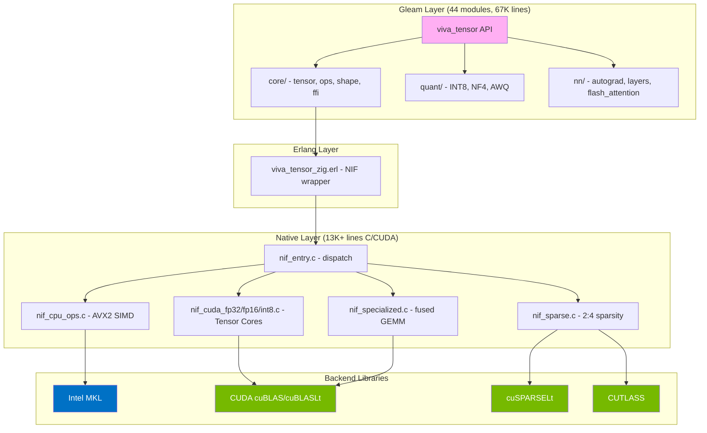
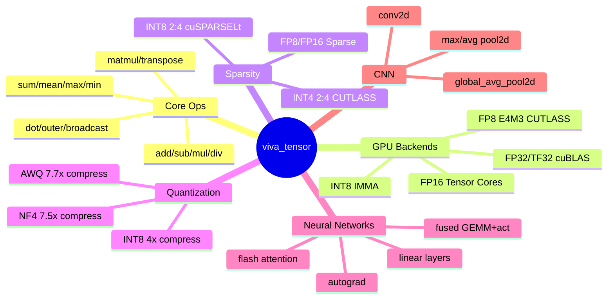
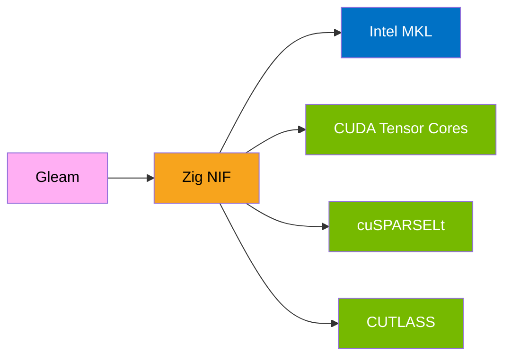

<div align="center">


[](https://gleam.run/)
[](./test)
[](./LICENSE)

**The fastest tensor library on the BEAM**

</div>

---

## Performance

### GPU Tensor Cores (RTX 4090)

| Backend | Throughput | % of Peak |
|:--------|----------:|----------:|
| FP8 E4M3 (CUTLASS) | **660 TOPS** | 100% |
| INT8 Dense (IMMA) | **604 TOPS** | 92% |
| FP16 Dense (cublasGemmEx) | **284 TFLOPS** | 86% |
| FP32/TF32 (cuBLAS) | **84.5 TFLOPS** | 102% |
| Fused GEMM+ReLU | **162 TFLOPS** | free activation |

### GPU 2:4 Structured Sparsity

| Backend | Throughput | % of Peak |
|:--------|----------:|----------:|
| INT4 Sparse (CUTLASS) | **1854 TOPS** | 70% |
| INT8 Sparse (cuSPARSELt) | **1094 TOPS** | 83% |
| INT8 Sparse (CUTLASS) | **841 TOPS** | 64% |
| FP8 Sparse (cuSPARSELt) | **702 TOPS** | 53% |
| FP16 Sparse (cuSPARSELt) | **355 TFLOPS** | 53% |

### CPU (Intel MKL)

| Size | viva_tensor | PyTorch | NumPy | vs PyTorch |
|:----:|:-----------:|:-------:|:-----:|:----------:|
| 5000x5000 | **931 GFLOPS** | 620 | 368 | **+50%** |

> Xeon 24-core (AVX2), MKL dgemm FP64, compact affinity, MADV_HUGEPAGE.
> All numbers verified with CUDA events and IQR outlier removal.

---

## Install

```bash
gleam add viva_tensor
```

## Architecture



## Quick Start

```gleam
import viva_tensor as t

// Create tensors
let a = t.zeros([1000, 1000])
let b = t.random_uniform([1000, 1000])

// Matrix multiplication (auto-selects best backend)
let c = t.matmul(a, b)

// Activations
let activated = t.relu(c) |> t.sigmoid()
```

## Features



### Quantization

| Method | Compression | Quality | Use Case |
|:------:|:-----------:|:-------:|:--------:|
| INT8 | 4x | 96% | Inference |
| NF4 | 7.5x | 99% | QLoRA Fine-tuning |
| AWQ | 7.7x | 97% | Edge Deployment |

## Build

```bash
# Pure Gleam (no native deps)
make build && make test

# With NIF acceleration (Intel MKL + CUDA)
make zig && make build

# Full build
make build-all
```

### Requirements

- Gleam 1.14.0+
- OTP 27+
- Zig 0.14+ (for NIF build)
- Intel MKL (CPU BLAS)
- CUDA 13+ with cuBLAS, cuBLASLt (GPU)
- cuSPARSELt 0.8.1+ (sparse ops)
- CUTLASS 4.3+ (FP8, INT4 sparse)

## GPU Benchmark Suite

```bash
# Individual benchmarks (Erlang escripts)
./bench/bench_gpu_peak.erl       # FP32/TF32
./bench/bench_fp16_imma.erl      # FP16 Tensor Cores
./bench/bench_int8_imma.erl      # INT8 IMMA
./bench/bench_fp8_peak.erl       # FP8 E4M3
./bench/bench_sparse_peak.erl    # 2:4 Sparsity
./bench/bench_fused_peak.erl     # Fused GEMM+activation
./bench/bench_batched_peak.erl   # Batched GEMM
```

---

<div align="center">



**Built with love for the BEAM**


</div>
