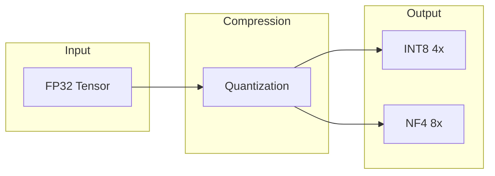
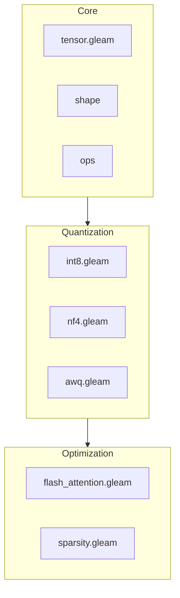

# viva_tensor

Pure Gleam tensor library focused on memory compression.

**[Português](../pt-br/README.md)** | **[中文](../zh-cn/README.md)**

## Core Concept



**Memory Multiplication:**

| Format | Compression | 24GB VRAM |
|:-------|:----------:|:----------|
| FP32 | 1x | 24 GB |
| INT8 | 4x | 96 GB |
| NF4 | 8x | 192 GB |

## Architecture



## Documentation

| Document | Description |
|:---------|:------------|
| [Getting Started](getting-started.md) | Installation and first steps |
| [Algorithms](algorithms.md) | INT8, NF4, AWQ, Flash Attention |
| [API](api.md) | Complete reference |
| [Why Revolutionary](why-revolutionary.md) | Scientific benchmarks |

## Build

```bash
make build    # Compile
make test     # Tests
make bench    # Benchmarks
```
