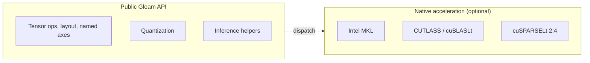

# viva_tensor

**[Português](../pt-br/README.md)** | **[中文](../zh-cn/README.md)**

Tensor library for Gleam/BEAM with a pure-Gleam public API and an optional
CUDA + CUTLASS NIF for high-throughput inference. The same `import viva_tensor as t`
code runs on a laptop without CUDA and on an RTX 4090 with FP8 Tensor Cores.


```mermaid
flowchart LR
    subgraph PublicAPI["Public Gleam API"]
        T[Tensor ops, layout, named axes]
        Q[Quantization]
        I[Inference helpers]
    end
    subgraph Native["Native acceleration (optional)"]
        MKL[Intel MKL]
        CUTLASS[CUTLASS / cuBLASLt]
        SPARSE[cuSPARSELt 2:4]
    end
    PublicAPI -.dispatch.-> Native
```

## What ships today

| Subsystem                          | Status      | Highlights                                                                                |
| :--------------------------------- | :---------- | :---------------------------------------------------------------------------------------- |
| Pure-Gleam tensor API              | Stable      | Shape, broadcast, autograd basics, named axes, fallback execution.                        |
| FP8 dense (CUTLASS + cuBLASLt)     | Production  | ~588 TFLOPS on RTX 4090. FP32 output buffers (no FP16 saturation).                        |
| FP8 W8A16 + per-block-16 scales    | Production  | Closes the numerical gap vs HF transformers; argmax token matches fp32 reference.         |
| Fused SwiGLU NIF                   | Production  | Single kernel for `silu(gate)·up` with per-channel dequant inside the kernel.             |
| INT8 2:4 sparse (cuSPARSELt)       | Production  | ~1320 TOPS. Byte-exact metadata via reorder_meta shim.                                    |
| INT4 2:4 sparse (CUTLASS Sm80)     | Production  | ~1854 TOPS. byte-exact end-to-end (kernel + reorder + encoding self-tested).              |
| SafeTensors loader                 | Functional  | bf16 → fp32, transpose via NIF (3 min → 25 s for full TinyLlama).                         |
| BPE tokenizer                      | Functional  | Encode/decode bit-exact vs HuggingFace transformers.                                      |
| End-to-end Llama-1.1B forward      | Functional  | 22 layers + RoPE + GQA + KV cache + LM head + argmax. Same argmax token as HF reference. |
| Advanced sampling (temp/top-k/p)   | Functional  | Multinomial with reproducible seed.                                                       |

## Quick Start

```bash
gleam add viva_tensor
```

```gleam
import viva_tensor as t

pub fn main() {
  let assert Ok(a) = t.matrix(2, 3, [1.0, 2.0, 3.0, 4.0, 5.0, 6.0])
  let assert Ok(b) = t.matrix(3, 2, [1.0, 0.0, 0.0, 1.0, 1.0, 0.0])
  let assert Ok(c) = t.matmul(a, b)
  c |> t.to_list
}
```

For the inference path (CUDA required):

```gleam
let assert Ok(packed) = t.prepack_fp8_weight(weight_tensor)
let assert Ok(logits) = t.linear_fp8(input, packed, None)
```

See [`guides/inference.md`](guides/inference.md) for end-to-end TinyLlama-1.1B
text generation.

## Documentation map

| Section                                                               | What is in it                                                                                   |
| :-------------------------------------------------------------------- | :---------------------------------------------------------------------------------------------- |
| [`api/tensor.md`](api/tensor.md)                                      | Stable public surface — tensor creation, math, reductions, layout, named axes.                  |
| [`api/inference.md`](api/inference.md)                                | FP8 prepack + linear, INT8/INT4 sparse, fused SwiGLU, packed weight handles.                    |
| [`guides/inference.md`](guides/inference.md)                          | End-to-end Llama-1.1B inference: SafeTensors → prepack → forward → sample → decode.             |
| [`guides/ffi-architecture.md`](guides/ffi-architecture.md)            | Maintainer-facing FFI ownership contract (NIF / CUDA / Zig boundary).                           |
| [`reference/project-structure.md`](reference/project-structure.md)    | Package layout and module boundaries.                                                           |
| [`reference/stability.md`](reference/stability.md)                    | Stable vs experimental boundary, semver expectations.                                           |
| [`paper.md`](paper.md)                                                | Technical paper.                                                                                |

## Performance snapshot

Measured on RTX 4090 (Ada SM89), Driver 595.71.05, CUDA 12.9. See
[`bench/results/matmul_showdown.md`](../../bench/results/matmul_showdown.md) for
methodology + tables across shapes and dtypes.

| Path                                  | Throughput        |
| :------------------------------------ | :---------------- |
| FP8 dense (CUTLASS, K=4096)           | ~588 TFLOPS       |
| INT8 2:4 sparse (cuSPARSELt)          | ~1320 TOPS        |
| INT4 2:4 sparse (CUTLASS Sm89)        | ~1854 TOPS        |
| TinyLlama-1.1B end-to-end (single-tok)| ~5.6 tok/sec      |

The Llama tok/sec figure is bounded by NIF round-trip + BEAM marshaling, not
GPU compute — a fused single-block NIF is the next throughput target.
