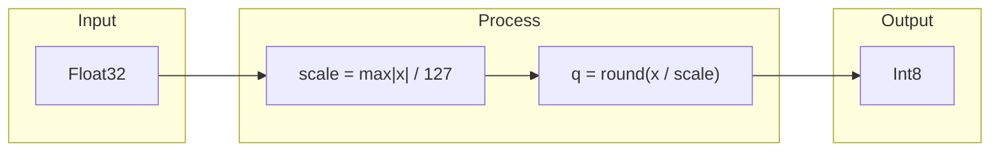
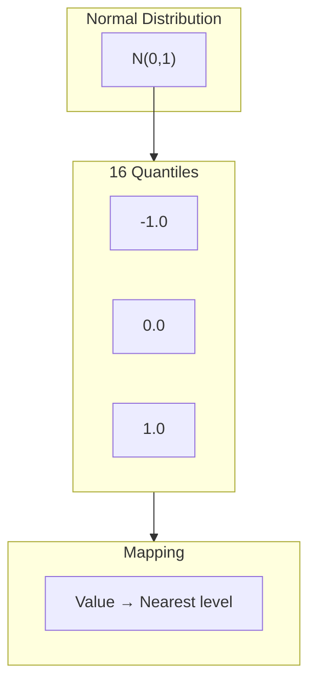
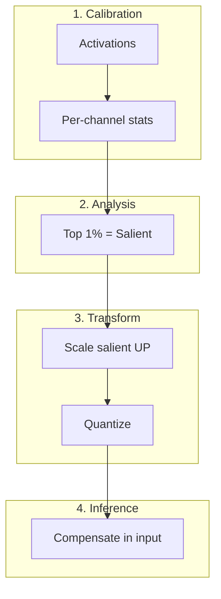
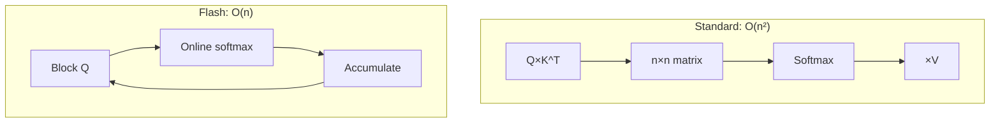
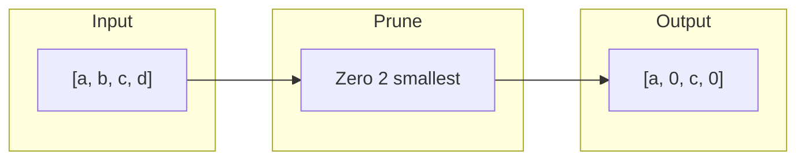

# Algorithms

## INT8 Symmetric Quantization

Reduces 32 bits to 8 bits using linear scaling.



**Formula:**

```
Quantization: q = round(x / scale)
Restoration:  x' = q × scale
```

| Property | Value |
|:---------|:------|
| Compression | 4x |
| Typical error | < 0.5% |
| Speed | Very fast |

---

## NF4 (NormalFloat4)

4-bit quantization optimized for Gaussian distribution.



**Why it works:**
- NN weights follow Gaussian distribution
- More levels near zero
- Mathematically optimal for normal data

---

## AWQ (Activation-aware Weight Quantization)

MLSys 2024 Best Paper. Uses activations to guide quantization.



**Key insight:**
- ~1% of weights are "salient"
- Identified by ACTIVATION magnitude
- Scale UP before quantizing preserves info

---

## Flash Attention

O(n) memory attention instead of O(n²).



**Trick: Online Softmax**

Compute max and sum incrementally without materializing full matrix.

---

## 2:4 Structured Sparsity

Sparsity pattern for NVIDIA Tensor Cores.



**Rule:** In every 4 elements, exactly 2 are zero.

| Property | Value |
|:---------|:------|
| Compression | 2x |
| HW overhead | Zero |
| Speedup | 2x on Tensor Cores |
