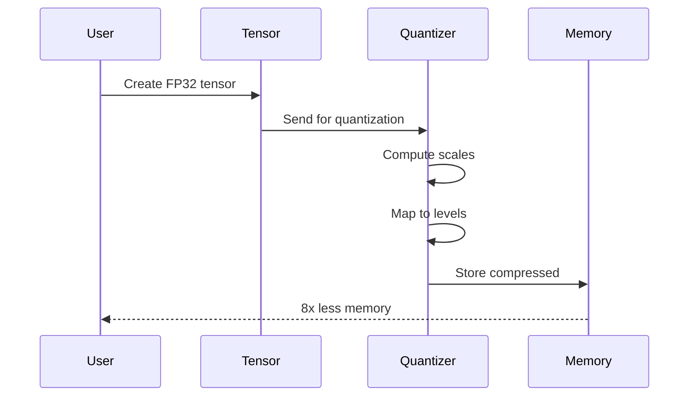
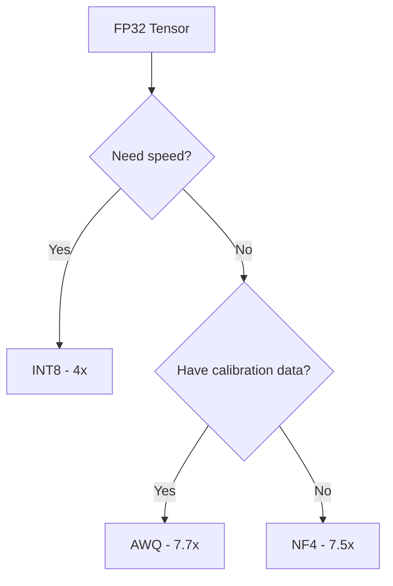

# Getting Started

## Installation

```bash
gleam add viva_tensor
```

## Requirements

| Tool | Version |
|:-----|:--------|
| Gleam | >= 1.6 |
| Erlang/OTP | >= 27 |

## First Example

```gleam
import viva_tensor/tensor
import viva_tensor/nf4

pub fn main() {
  // Create random tensor
  let t = tensor.random_uniform([1024, 512])

  // Quantize to NF4 (8x compression)
  let config = nf4.default_config()
  let compressed = nf4.quantize(t, config)

  // Check compression ratio
  io.println("Ratio: " <> float.to_string(compressed.compression_ratio))

  // Restore
  let restored = nf4.dequantize(compressed)
}
```

## Compression Pipeline



## Choosing Algorithm



| Algorithm | Compression | When to use |
|:----------|:----------:|:------------|
| INT8 | 4x | Speed, simple inference |
| NF4 | 7.5x | No calibration, general use |
| AWQ | 7.7x | Max quality with calibration |
