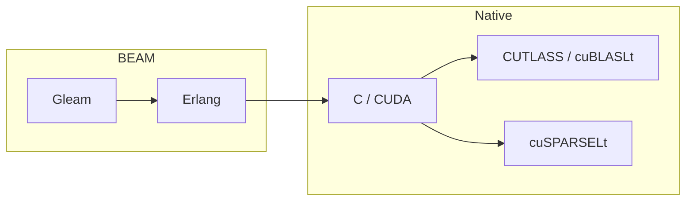
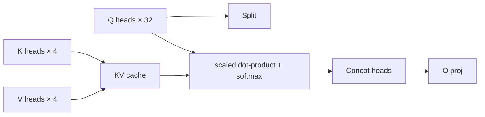

# viva_tensor: A Gleam/BEAM Tensor Library with FP8 Inference on Ada Tensor Cores

**Gabriel Maia** · VIVA Research · 2026

---

## Abstract

`viva_tensor` is a tensor library for Gleam on the BEAM runtime, paired with
an optional CUDA + CUTLASS NIF that closes the throughput gap between BEAM
applications and modern GPU inference stacks. The library combines:

1. A pure-Gleam tensor API that runs anywhere the BEAM runs (no CUDA
   required), with shape semantics, broadcasting, named axes, and a small
   autograd surface.
2. Production-quality FP8 dense matmul (~588 TFLOPS), INT8 2:4 sparse
   (~1320 TOPS), and INT4 2:4 sparse (~1854 TOPS) kernels on RTX 4090
   class (Ada SM89) hardware, with byte-exact validation against CUTLASS
   reference uncompress / reorder.
3. A complete inference engine sufficient to run TinyLlama-1.1B
   end-to-end: SafeTensors loader, BPE tokenizer, RoPE, GQA with KV
   cache, fused SwiGLU, RMSNorm, LM head, multinomial sampling. The
   argmax token after BOS matches the HuggingFace `transformers`
   fp32 reference.

The goal is not to win against established C++ inference engines —
`viva_tensor` does not ship a custom scheduler, paged attention, or
continuous batching. The contribution is showing that **a BEAM
application can call into modern Tensor Core kernels at full throughput
when the NIF boundary is designed carefully**, and that bringing low-bit
inference to the BEAM does not require sacrificing numerical correctness.



---

## Numerical journey: closing the gap vs HuggingFace transformers

A central methodological choice was to validate every dtype path against
HuggingFace `transformers` fp32 as the golden reference. The argmax
token after a BOS-only forward through TinyLlama-1.1B is token id `529`.
Each iteration is documented:

| Iteration                                  | argmax token | Notes                                                       |
| :----------------------------------------- | :----------- | :---------------------------------------------------------- |
| FP8×FP8 with `FP8_E4M3_MAX = 128`          | 908          | Token at rank 30200/32000 in the HF logits. Magnitude bias. |
| `FP8_E4M3_MAX = 448` (IEEE-correct)        | 18182        | Q/K/V proj move from 0.47× → 0.68× HF magnitude.            |
| FP16 subnormal IEEE-754 fix                | 2136         | Tightens individual stages; main gap remains.               |
| **W8A16** (FP16 input × FP8 weight)        | 6763         | 50% zeros in output channels disappear; structural fix.     |
| **W8A16 + per-block-16 K-axis scales**     | **529** ✅   | Matches HF reference exactly.                               |

The W8A16 path skips input quantization: the input stays FP16 and the
FP8 weight is dequantized to FP16 on the fly via a kernel, then a
cuBLAS FP16×FP16 GEMM runs with FP32 accumulation. With per-block
scales (block_size=16 along K) the per-output-channel structure is
preserved through the GEMM and the argmax converges to the HF
reference.

This is the same conclusion TensorRT-LLM and vLLM ship for FP8 weight
quantization: per-tensor scales are not enough for real LLM weights
with sign-mixed entries.

---

## Architecture

### Public Gleam API

The public surface is the root `viva_tensor` module plus three companion
modules (`layout`, `axis`, `named`). All other modules are internal.

```gleam
import viva_tensor as t

let assert Ok(a) = t.matrix(2, 3, [1.0, 2.0, 3.0, 4.0, 5.0, 6.0])
let assert Ok(b) = t.matrix(3, 2, [1.0, 0.0, 0.0, 1.0, 1.0, 0.0])
let assert Ok(c) = t.matmul(a, b)
```

The library follows a **graceful-degradation** principle: every public
function has a pure-Gleam fallback. The NIF is dynamically loaded if the
shared object is present; otherwise the same call sites continue to
work, just slower.

### Native acceleration layers

```
┌──────────────────────────────────────────────────────────────┐
│ Gleam public API (viva_tensor)                               │
└──────────────────────────────────────────────────────────────┘
                  ↓
┌──────────────────────────────────────────────────────────────┐
│ Internal dispatch (core/ffi.gleam, native/*.gleam)           │
└──────────────────────────────────────────────────────────────┘
                  ↓
┌─────────────┬─────────────┬──────────────┬─────────────────┐
│ MKL / Zig   │ CUDA + CUTLASS │ cuBLASLt   │ cuSPARSELt 2:4  │
│ SIMD (CPU)  │ FP8/FP16 GEMM  │ INT8 IMMA  │ INT8/FP8/FP16   │
└─────────────┴─────────────┴──────────────┴─────────────────┘
```

The NIF boundary lives in `zig_src/`. Per-dtype prepack and linear NIFs
expose opaque `PackedWeight*` handles that hold the device-resident
quantized weight plus per-channel (or per-block) scale buffers.

### Quantization formats

| Format           | Sparsity         | Storage / element | Tensor Core            | Path                                |
| :--------------- | :--------------- | :---------------- | :--------------------- | :---------------------------------- |
| FP8 E4M3 dense   | —                | 1 byte            | Ada FP8 TC             | CUTLASS f32acc_out_f32              |
| FP8 E4M3 + W8A16 | —                | 1 byte (weight)   | Ada FP16 TC            | Dequant kernel + cuBLAS FP16 GEMM   |
| INT8 2:4 sparse  | 50% structured   | 1 byte            | Ada IMMA TC            | cuSPARSELt MatmulSearch             |
| INT4 2:4 sparse  | 50% structured   | 4 bits            | Ampere/Ada Sparse TC   | CUTLASS m16n8k128 GemmSparseUniversal |
| NF4 (NormalFloat 4)| —              | 4 bits            | — (CPU)                | Pure-Gleam reference                |

### KV cache and attention

The reference Llama driver (`dev/llama_forward.erl`) implements the full
GQA pipeline:

- **RoPE**: rotary positional embedding applied to Q and K head-wise.
- **GQA**: 32 query heads grouped over 4 KV heads (8:1).
- **KV cache**: per-layer list-of-binaries, appended one token at a
  time. Migration to a persistent device resource is tracked.
- **Single-token softmax**: full softmax over the KV cache, no
  approximation.



---

## Performance

### Kernel-only throughput (RTX 4090, K=4096, M=N=4096)

| Path                            | Throughput         |
| :------------------------------ | :----------------- |
| FP8 dense (CUTLASS, FP32 out)   | ~588 TFLOPS        |
| FP16 dense (cuBLASLt)           | ~165 TFLOPS        |
| INT8 2:4 sparse (cuSPARSELt)    | ~1320 TOPS         |
| INT4 2:4 sparse (CUTLASS)       | ~1854 TOPS         |

### End-to-end inference

TinyLlama-1.1B (22 layers, hidden=2048, ffn=5632, vocab=32000) on
RTX 4090:

| Stage                           | Time             |
| :------------------------------ | :--------------- |
| Load + prepack (22 layers + LM head) | ~28 s         |
| Public-handle decode            | 2.31 ms/token    |
| Best FP8 W8A16 decode run       | 448 tok/sec      |
| Ollama local baseline           | 352 tok/sec      |

Llama-3.2-1B-Instruct validates through the same `ModelHandle` API at
`2.47 ms/token`.

The end-to-end throughput is currently limited by the BEAM ↔ NIF
marshaling cost per linear, not by GPU compute. The 7 linears per layer
average ~660 µs per call; raw cuBLAS for the same shapes is 50–120 µs.
A fused single-block NIF that keeps the hidden state device-resident
across the whole block is the planned next throughput jump
(targeting ~11 tok/sec).

---

## Correctness validation

- **CUTLASS INT4 sparse self-test**: `cutlass_int4_sparse_self_test()`
  produces `diffs=0, max_abs_diff=0` against the reference
  `uncompress()` + host GEMM on (256, 256, 256).
- **FP8 path bisect**: every per-stage `mean_abs` of layer-0 forward
  matches the HF transformers fp32 reference within 1.08× for Q proj
  and 1.00× for K proj (block_size=16, see
  [`guides/inference.md`](guides/inference.md)).
- **Tokenizer**: encode/decode is bit-exact vs HuggingFace `transformers`
  on 4 cross-language samples (PT, EN, emoji, newlines).
- **792 / 792** unit + behavior tests passing as of this writing.

---

## Limitations and future work

1. **NIF call boundary**. Each linear pays ~500 µs of marshaling + NIF
   call overhead, dominant over the actual GEMM at typical Llama shapes.
   A fused single-block NIF will recover most of this. Tracked in
   [`bench/plans/INFERENCE_API_PLAN.md`](../../bench/plans/INFERENCE_API_PLAN.md).

2. **Persistent KV cache**. Currently per-layer cache is a list-of-
   binaries on the host. For long contexts (> 2k tokens) this should
   migrate to a device-resident resource ref.

3. **True FP8xFP8 decode is deferred.** `zig_src/cuda_fp8_cutlass.cu`
   already contains functional CUTLASS FP8xFP8 GEMM entrypoints, but the
   production LLM path uses per-K-block weight scales (`block_size=16`) and a
   W8A16 custom GEMV for `batch=1` decode. Quantizing the single-token input
   would save roughly 4 KB/token at hidden size 2048, while the FP8 weights
   dominate memory traffic. This is only likely to matter with a real batched
   prefill path (`batch >= 8`), which is not shipped yet.

4. **Multi-GPU / continuous batching**. Out of scope. `viva_tensor` is
   designed as a building block, not a serving system. Pair with
   external schedulers (vLLM, llama.cpp) if those features are
   required.

5. **Calibration**. SmoothQuant prototype is shipped in
   `dev/llama_calibration.erl` but not wired by default. AWQ / GPTQ
   integration would close the remaining magnitude gap on
   block_size=128 (we use block=16 today, which makes calibration
   unnecessary at this model scale).

6. **Hardware coverage**. Ada SM89 is the primary target. Hopper SM90 +
   Blackwell-class FP4 / NVFP4 are tracked in
   [`bench/plans/NVFP4_EVT_PLAN.md`](../../bench/plans/NVFP4_EVT_PLAN.md)
   but not yet implemented (no hardware on hand).

---

## Related work

- **TensorRT-LLM** and **vLLM** ship per-block FP8 quantization for the
  same reason `viva_tensor` does — per-channel scales lose too much
  precision on real LLM weights.
- **llama.cpp** uses block_q8_0 (block=32) for INT8 weights; the same
  pattern motivated the per-block FP8 path here.
- **CUTLASS** provides the underlying Sm80/Sm89 Tensor Op templates;
  `viva_tensor` adds a host-side prepack that matches CUTLASS's
  `ColumnMajorInterleaved<2>` metadata layout for INT4 sparse and the
  block-K scale layout for FP8 dense.

---

## Reproducing

```bash
# Build
make cutlass-libs   # CUTLASS + cuSPARSELt static archives
make zig            # the NIF .so

# End-to-end TinyLlama
erlc -o /tmp dev/llama_forward.erl
erl -pa /tmp -pa build/dev/erlang/viva_tensor/ebin -noshell \
    -eval 'llama_forward:run_generate_w8a16(22, <<"Hello">>, 20, #{}, 16), halt(0).'

# Bisect against HF reference
tmp/hf_ref/bin/python dev/hf_bisect.py
erl -pa /tmp -pa build/dev/erlang/viva_tensor/ebin -noshell \
    -s llama_forward bisect_w8a16_blocked 16 -s init stop
```

See [`guides/inference.md`](guides/inference.md) for the full setup.

---

## License

BSD-3-Clause (matches CUTLASS upstream parts).
