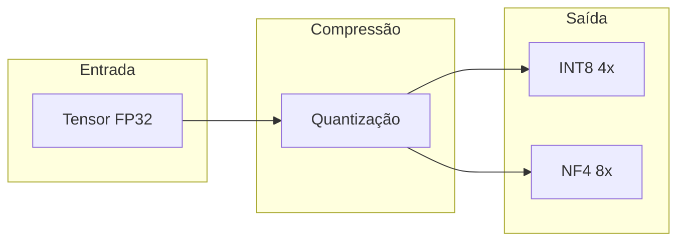
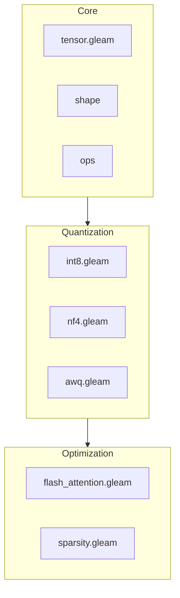

# viva_tensor

Biblioteca de tensors em Pure Gleam para compressão de memória.

**[English](../en/README.md)** | **[中文](../zh-cn/README.md)**

## Conceito Central



**Multiplicação de Memória:**

| Formato | Compressão | 24GB VRAM |
|:--------|:----------:|:----------|
| FP32 | 1x | 24 GB |
| INT8 | 4x | 96 GB |
| NF4 | 8x | 192 GB |

## Arquitetura



## Documentação

| Documento | Descrição |
|:----------|:----------|
| [Início Rápido](guia-inicio.md) | Instalação e primeiros passos |
| [Algoritmos](algoritmos.md) | INT8, NF4, AWQ, Flash Attention |
| [API](api.md) | Referência completa |

## Build

```bash
make build    # Compilar
make test     # Testes
make bench    # Benchmarks
```
