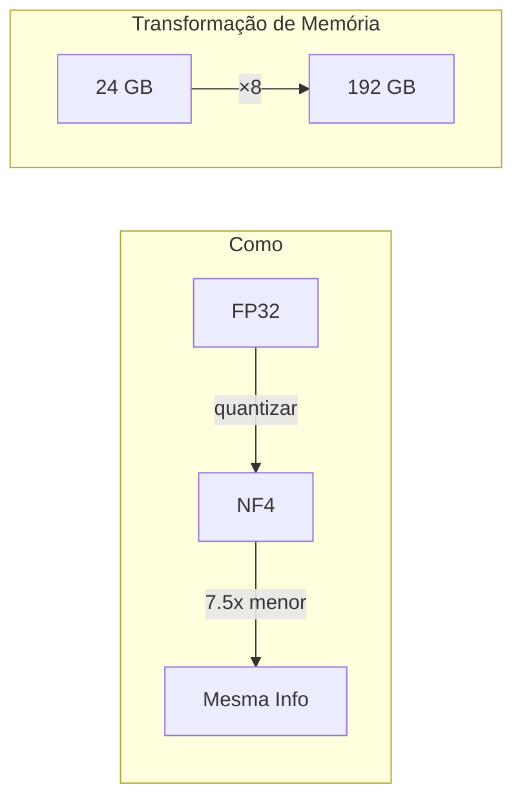
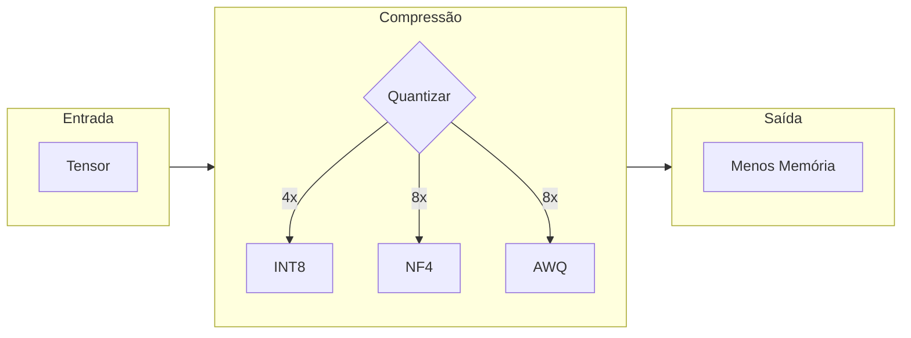

# viva_tensor

**[English](../en/README.md)** | **[中文](../zh-cn/README.md)**



## Conceito



## Início Rápido

```gleam
import viva_tensor/nf4

let compressed = nf4.quantize(tensor, nf4.default_config())
// 8x menos memória, mesma informação
```

## Performance

| Método | Compressão | Eficiência |
|:-------|:----------:|:----------:|
| INT8 | 4x | 40% |
| NF4 | 7.5x | 77% |
| AWQ | 7.7x | 53% |

**[Referência API →](api.md)**
