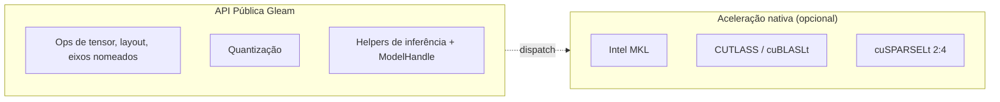

# viva_tensor

**[English](../en/README.md)** | **[中文](../zh-cn/README.md)**

Biblioteca de tensores pra Gleam/BEAM com API pública 100% Gleam e uma NIF
opcional em CUDA + CUTLASS pra inferência de alto throughput. O mesmo
`import viva_tensor as t` roda num notebook sem CUDA e numa RTX 4090 com
Tensor Cores FP8.


```mermaid
flowchart LR
    subgraph APIPublica["API Pública Gleam"]
        T[Ops de tensor, layout, eixos nomeados]
        Q[Quantização]
        I[Helpers de inferência + ModelHandle]
    end
    subgraph Native["Aceleração nativa (opcional)"]
        MKL[Intel MKL]
        CUTLASS[CUTLASS / cuBLASLt]
        SPARSE[cuSPARSELt 2:4]
    end
    APIPublica -.dispatch.-> Native
```

## O que já tá pronto

| Subsistema                            | Status      | Destaques                                                                                |
| :------------------------------------ | :---------- | :--------------------------------------------------------------------------------------- |
| API de tensor 100% Gleam              | Estável     | Shape, broadcast, autograd básico, eixos nomeados, execução fallback.                    |
| FP8 dense (CUTLASS + cuBLASLt)        | Produção    | ~588 TFLOPS na RTX 4090. Buffers de saída FP32 (sem saturação FP16).                     |
| FP8 W8A16 + scales por bloco-16       | Produção    | Fecha o gap numérico vs HF transformers; token argmax bate com referência fp32.          |
| NIF SwiGLU fundida                    | Produção    | Kernel único pra `silu(gate)·up` com dequantização per-channel dentro do kernel.         |
| INT8 2:4 sparse (cuSPARSELt)          | Produção    | ~1320 TOPS. Metadata byte-exact via shim de reorder_meta.                                |
| INT4 2:4 sparse (CUTLASS Sm80)        | Produção    | ~1854 TOPS. byte-exact end-to-end (kernel + reorder + encoding com self-test).           |
| Loader SafeTensors                    | Funcional   | bf16 → fp32, transpose via NIF (3 min → 25 s pro TinyLlama inteiro).                     |
| Tokenizer BPE                         | Funcional   | Encode/decode bit-exact vs HuggingFace transformers.                                     |
| API pública LLM `ModelHandle`         | Produção    | `load_model` + `generate` pra TinyLlama-1.1B e Llama-3.2-1B-Instruct.                    |
| Sampling avançado (temp/top-k/p)      | Funcional   | Multinomial com seed reprodutível.                                                       |

## Quick Start

```bash
gleam add viva_tensor
```

```gleam
import viva_tensor as t

pub fn main() {
  let assert Ok(a) = t.matrix(2, 3, [1.0, 2.0, 3.0, 4.0, 5.0, 6.0])
  let assert Ok(b) = t.matrix(3, 2, [1.0, 0.0, 0.0, 1.0, 1.0, 0.0])
  let assert Ok(c) = t.matmul(a, b)
  c |> t.to_list
}
```

Pra geração de texto da família Llama (precisa de CUDA):

```gleam
let assert Ok(model) = t.load_model("tmp/tinyllama/model.safetensors")
let opts = t.default_generate_opts()
let assert Ok(result) = t.generate(model, "Hello", opts)
```

Veja [`guides/inference.md`](guides/inference.md) pra geração de texto
end-to-end com TinyLlama-1.1B.

## Mapa da documentação

| Seção                                                                 | O que tem dentro                                                                                |
| :-------------------------------------------------------------------- | :---------------------------------------------------------------------------------------------- |
| [`api/tensor.md`](api/tensor.md)                                      | Superfície pública estável — criação de tensor, math, reduções, layout, eixos nomeados.         |
| [`api/inference.md`](api/inference.md)                                | Prepack FP8 + linear, INT8/INT4 sparse, SwiGLU fundida, handles de peso empacotado.             |
| [`api/llm.md`](api/llm.md)                                            | API pública `ModelHandle`: `load_model`, `generate`, opções, modelos testados.                  |
| [`guides/inference.md`](guides/inference.md)                          | Inferência Llama-1.1B end-to-end: SafeTensors → prepack → forward → sample → decode.            |
| [`guides/ffi-architecture.md`](guides/ffi-architecture.md)            | Contrato de ownership FFI voltado pra mantenedor (fronteira NIF / CUDA / Zig).                  |
| [`reference/project-structure.md`](reference/project-structure.md)    | Layout do pacote e fronteiras entre módulos.                                                    |
| [`reference/stability.md`](reference/stability.md)                    | Fronteira estável vs experimental, expectativas de semver.                                      |
| [`paper.md`](paper.md)                                                | Paper técnico.                                                                                  |

## Snapshot de performance

Medido em RTX 4090 (Ada SM89), Driver 595.71.05, CUDA 12.9. Veja
[`bench/results/matmul_showdown.md`](../../bench/results/matmul_showdown.md)
pra metodologia + tabelas por shape e dtype.

| Caminho                                 | Throughput        |
| :-------------------------------------- | :---------------- |
| FP8 dense (CUTLASS, K=4096)             | ~588 TFLOPS       |
| INT8 2:4 sparse (cuSPARSELt)            | ~1320 TOPS        |
| INT4 2:4 sparse (CUTLASS Sm89)          | ~1854 TOPS        |
| TinyLlama-1.1B melhor decode FP8 W8A16  | 448 tok/s         |
| TinyLlama-1.1B via `ModelHandle`        | 2.31 ms/token     |
| Llama-3.2-1B-Instruct via `ModelHandle` | 2.47 ms/token     |

O número de tok/s do Llama tá limitado por round-trip da NIF + marshaling
BEAM, não pelo compute na GPU — uma NIF de bloco único fundida é o próximo
alvo de throughput.
