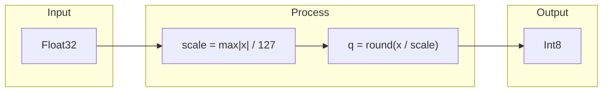
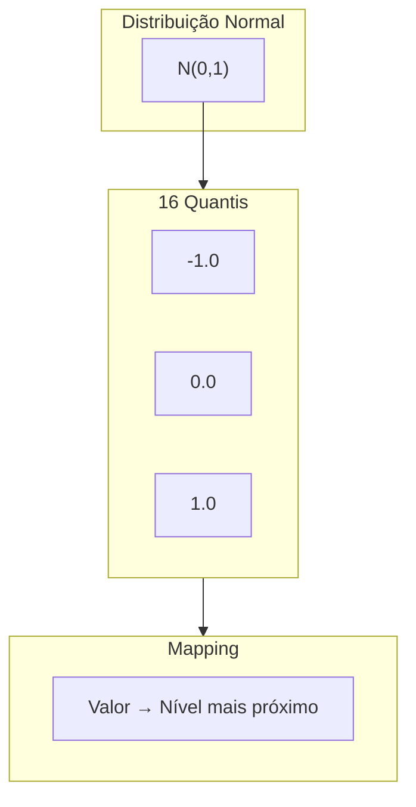
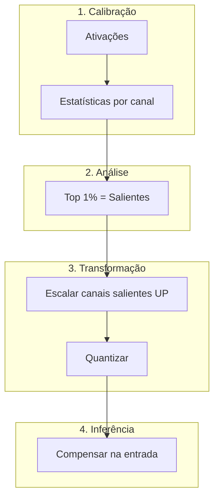
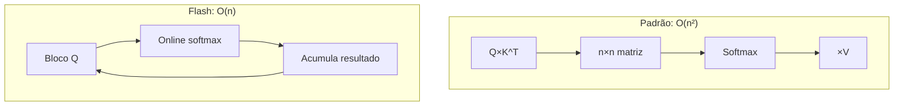
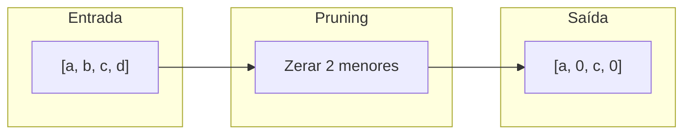

# Algoritmos

## INT8 Quantização Simétrica

Reduz 32 bits para 8 bits usando escala linear.



**Fórmula:**

```
Quantização:  q = round(x / scale)
Restauração:  x' = q × scale
```

**Características:**

| Propriedade | Valor |
|:------------|:------|
| Compressão | 4x |
| Erro típico | < 0.5% |
| Velocidade | Muito rápida |

---

## NF4 (NormalFloat4)

Quantização 4-bit otimizada para distribuição gaussiana.



**Por que funciona:**
- Pesos de NNs seguem distribuição gaussiana
- Mais níveis próximos de zero
- Matematicamente ótimo para dados normais

**Níveis NF4:**

| Índice | Valor |
|:------:|:------|
| 0 | -1.0000 |
| 7 | 0.0000 |
| 15 | 1.0000 |

---

## AWQ (Activation-aware Weight Quantization)

MLSys 2024 Best Paper. Usa ativações para guiar quantização.



**Insight principal:**
- ~1% dos pesos são "salientes"
- Identificados pela magnitude das ATIVAÇÕES
- Escalar UP antes de quantizar preserva informação

**Matemática:**

```
W × X = (s×W) × (X/s)
       ↑        ↑
    quantiza  compensa
```

---

## Flash Attention

Atenção com O(n) memória ao invés de O(n²).



**Truque: Online Softmax**

Computa max e sum incrementalmente sem materializar matriz completa.

---

## 2:4 Structured Sparsity

Padrão de esparsidade para NVIDIA Tensor Cores.



**Regra:** Em cada 4 elementos, exatamente 2 são zero.

```
Válido:   [a, 0, b, 0]  [0, a, 0, b]  [a, b, 0, 0]
Inválido: [a, 0, 0, 0]  [a, b, c, 0]
```

| Propriedade | Valor |
|:------------|:------|
| Compressão | 2x |
| Overhead HW | Zero |
| Aceleração | 2x em Tensor Cores |
