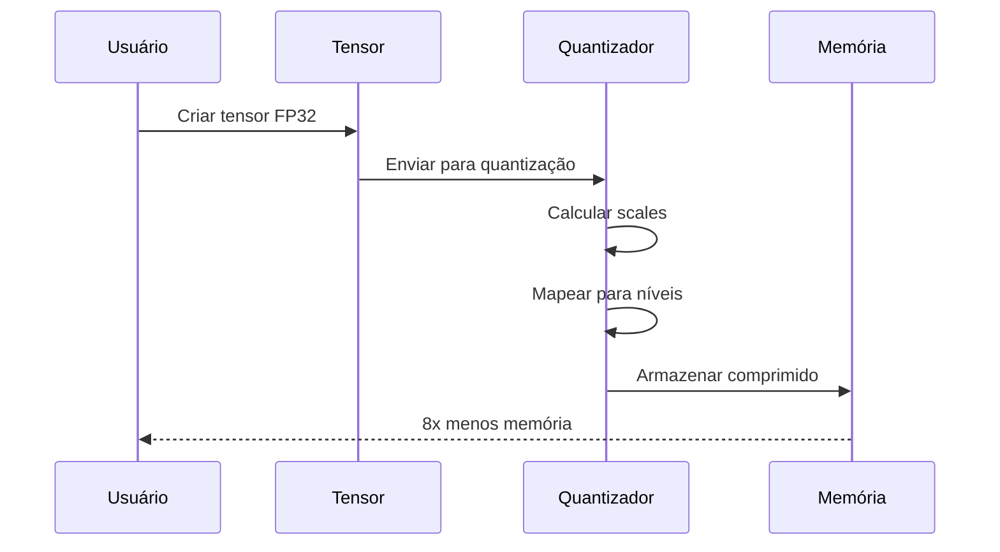
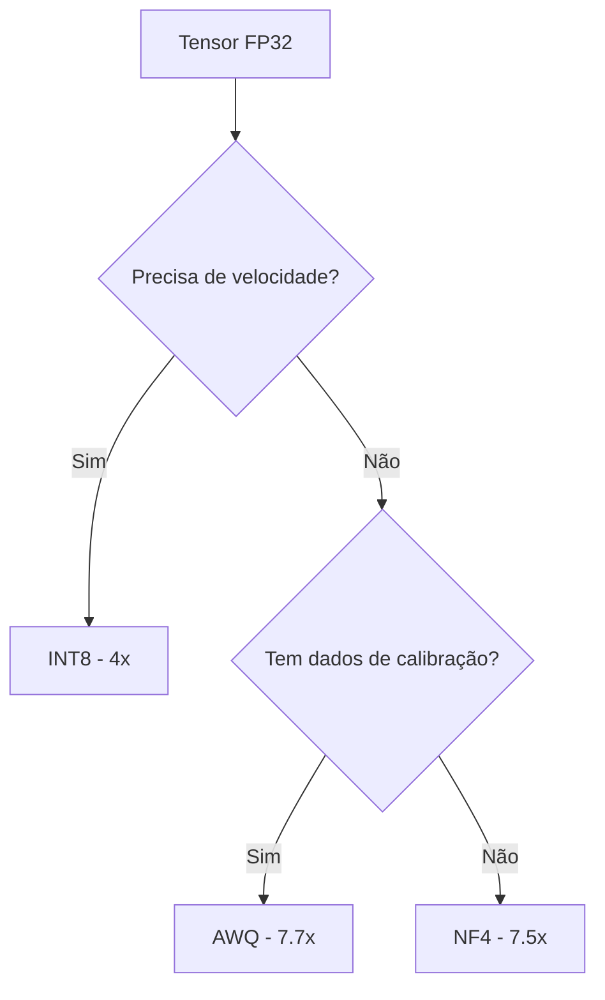

# Início Rápido

## Instalação

```bash
gleam add viva_tensor
```

## Requisitos

| Ferramenta | Versão |
|:-----------|:-------|
| Gleam | >= 1.6 |
| Erlang/OTP | >= 27 |

## Primeiro Exemplo

```gleam
import viva_tensor/tensor
import viva_tensor/nf4

pub fn main() {
  // Criar tensor aleatório
  let t = tensor.random_uniform([1024, 512])

  // Quantizar para NF4 (8x compressão)
  let config = nf4.default_config()
  let compressed = nf4.quantize(t, config)

  // Verificar compressão
  io.println("Ratio: " <> float.to_string(compressed.compression_ratio))

  // Restaurar
  let restored = nf4.dequantize(compressed)
}
```

## Pipeline de Compressão



## Escolhendo o Algoritmo



| Algoritmo | Compressão | Quando usar |
|:----------|:----------:|:------------|
| INT8 | 4x | Velocidade, inferência simples |
| NF4 | 7.5x | Sem calibração, uso geral |
| AWQ | 7.7x | Máxima qualidade com calibração |
