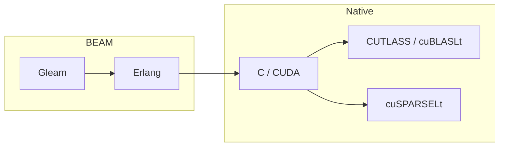
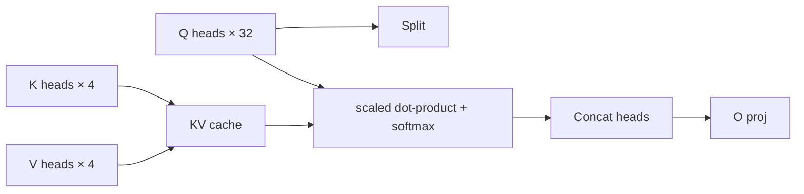

# viva_tensor: Uma biblioteca de tensores Gleam/BEAM com inferência FP8 em Tensor Cores Ada

**Gabriel Maia** · VIVA Research · 2026

---

## Resumo

`viva_tensor` é uma biblioteca de tensores pra Gleam no runtime BEAM,
acompanhada de uma NIF opcional em CUDA + CUTLASS que fecha o gap de
throughput entre aplicações BEAM e stacks modernos de inferência GPU. A
biblioteca combina:

1. Uma API de tensor 100% Gleam que roda em qualquer lugar que o BEAM roda
   (sem CUDA necessário), com semântica de shape, broadcasting, eixos
   nomeados e uma pequena superfície de autograd.
2. Kernels FP8 dense matmul de qualidade de produção (~588 TFLOPS), INT8
   2:4 sparse (~1320 TOPS) e INT4 2:4 sparse (~1854 TOPS) em hardware
   classe RTX 4090 (Ada SM89), com validação byte-exact contra
   uncompress / reorder de referência do CUTLASS.
3. Uma engine de inferência completa o suficiente pra rodar TinyLlama-1.1B
   end-to-end: loader SafeTensors, tokenizer BPE, RoPE, GQA com KV cache,
   SwiGLU fundido, RMSNorm, LM head, sampling multinomial. O token argmax
   depois do BOS bate com a referência fp32 do HuggingFace `transformers`.

A meta não é vencer engines C++ estabelecidos de inferência —
`viva_tensor` não traz scheduler customizado, paged attention ou batching
contínuo. A contribuição é mostrar que **uma aplicação BEAM consegue
chamar kernels modernos de Tensor Core em throughput pleno quando a
fronteira NIF é projetada com cuidado**, e que trazer inferência low-bit
pra BEAM não exige sacrificar correctness numérica.



---

## Jornada numérica: fechando o gap vs HuggingFace transformers

Uma escolha metodológica central foi validar cada caminho de dtype contra
HuggingFace `transformers` fp32 como referência golden. O token argmax
depois de um forward só-BOS pelo TinyLlama-1.1B é o token id `529`. Cada
iteração é documentada:

| Iteração                                   | Token argmax | Notas                                                       |
| :----------------------------------------- | :----------- | :---------------------------------------------------------- |
| FP8×FP8 com `FP8_E4M3_MAX = 128`           | 908          | Token no rank 30200/32000 nos logits HF. Bias de magnitude. |
| `FP8_E4M3_MAX = 448` (IEEE-correto)        | 18182        | Q/K/V proj sobem de 0.47× → 0.68× da magnitude HF.          |
| Fix de subnormal IEEE-754 FP16             | 2136         | Aperta estágios individuais; gap principal continua.        |
| **W8A16** (FP16 input × FP8 weight)        | 6763         | 50% de zeros nos canais de saída somem; fix estrutural.     |
| **W8A16 + scales per-block-16 no eixo K**  | **529** ✅   | Bate com a referência HF exatamente.                        |

O caminho W8A16 pula a quantização do input: o input fica FP16 e o peso
FP8 é dequantizado pra FP16 on-the-fly via um kernel, depois um GEMM
FP16×FP16 do cuBLAS roda com acumulação FP32. Com scales per-block
(block_size=16 ao longo de K) a estrutura per-output-channel é preservada
pelo GEMM e o argmax converge pra referência HF.

Essa é a mesma conclusão que TensorRT-LLM e vLLM entregam pra
quantização de peso FP8: scales per-tensor não bastam pra pesos reais de
LLM com entradas com signs mistos.

---

## Arquitetura

### API pública Gleam

A superfície pública é o módulo raiz `viva_tensor` mais três módulos
companheiros (`layout`, `axis`, `named`). Todos os outros módulos são
internos.

```gleam
import viva_tensor as t

let assert Ok(a) = t.matrix(2, 3, [1.0, 2.0, 3.0, 4.0, 5.0, 6.0])
let assert Ok(b) = t.matrix(3, 2, [1.0, 0.0, 0.0, 1.0, 1.0, 0.0])
let assert Ok(c) = t.matmul(a, b)
```

A biblioteca segue um princípio de **graceful degradation**: cada função
pública tem um fallback 100% Gleam. A NIF é carregada dinamicamente se o
shared object tá presente; caso contrário, os mesmos call sites
continuam funcionando, só mais devagar.

### Camadas de aceleração nativa

```
┌──────────────────────────────────────────────────────────────┐
│ API pública Gleam (viva_tensor)                              │
└──────────────────────────────────────────────────────────────┘
                  ↓
┌──────────────────────────────────────────────────────────────┐
│ Dispatch interno (core/ffi.gleam, native/*.gleam)            │
└──────────────────────────────────────────────────────────────┘
                  ↓
┌─────────────┬─────────────┬──────────────┬─────────────────┐
│ MKL / Zig   │ CUDA + CUTLASS │ cuBLASLt   │ cuSPARSELt 2:4  │
│ SIMD (CPU)  │ FP8/FP16 GEMM  │ INT8 IMMA  │ INT8/FP8/FP16   │
└─────────────┴─────────────┴──────────────┴─────────────────┘
```

A fronteira NIF vive em `zig_src/`. NIFs de prepack e linear per-dtype
expõem handles opacos `PackedWeight*` que mantêm o peso quantizado
residente no device mais o buffer de scale per-channel (ou per-block) que
a chamada `linear_*` correspondente espera.

### Formatos de quantização

| Formato          | Esparsidade      | Storage / elemento | Tensor Core            | Caminho                              |
| :--------------- | :--------------- | :----------------- | :--------------------- | :----------------------------------- |
| FP8 E4M3 dense   | —                | 1 byte             | Ada FP8 TC             | CUTLASS f32acc_out_f32               |
| FP8 E4M3 + W8A16 | —                | 1 byte (weight)    | Ada FP16 TC            | Kernel de dequant + GEMM FP16 cuBLAS |
| INT8 2:4 sparse  | 50% estruturada  | 1 byte             | Ada IMMA TC            | cuSPARSELt MatmulSearch              |
| INT4 2:4 sparse  | 50% estruturada  | 4 bits             | Ampere/Ada Sparse TC   | CUTLASS m16n8k128 GemmSparseUniversal |
| NF4 (NormalFloat 4) | —             | 4 bits             | — (CPU)                | Referência 100% Gleam                |

### KV cache e atenção

O driver Llama de referência (`dev/llama_forward.erl`) implementa a
pipeline GQA completa:

- **RoPE**: rotary positional embedding aplicado a Q e K head-wise.
- **GQA**: 32 query heads agrupados em 4 KV heads (8:1).
- **KV cache**: lista de binaries per-layer, anexada um token de cada
  vez. Migração pra um recurso persistente no device é rastreada.
- **Softmax de token único**: softmax completo sobre o KV cache, sem
  aproximação.



---

## Performance

### Throughput só-kernel (RTX 4090, K=4096, M=N=4096)

| Caminho                         | Throughput         |
| :------------------------------ | :----------------- |
| FP8 dense (CUTLASS, FP32 out)   | ~588 TFLOPS        |
| FP16 dense (cuBLASLt)           | ~165 TFLOPS        |
| INT8 2:4 sparse (cuSPARSELt)    | ~1320 TOPS         |
| INT4 2:4 sparse (CUTLASS)       | ~1854 TOPS         |

### Inferência end-to-end

TinyLlama-1.1B (22 layers, hidden=2048, ffn=5632, vocab=32000) na
RTX 4090:

| Estágio                              | Tempo            |
| :----------------------------------- | :--------------- |
| Load + prepack (22 layers + LM head) | ~28 s            |
| Decode pelo handle público           | 2.31 ms/token    |
| Melhor run de decode FP8 W8A16       | 448 tok/sec      |
| Baseline local Ollama                | 352 tok/sec      |

Llama-3.2-1B-Instruct valida pela mesma API `ModelHandle` em
`2.47 ms/token`.

O throughput end-to-end tá atualmente limitado pelo custo de marshaling
BEAM ↔ NIF por linear, não por compute na GPU. Os 7 lineares por layer
têm média ~660 µs por chamada; cuBLAS cru pra essas mesmas shapes é
50–120 µs. Uma NIF de bloco único fundida que mantenha o hidden state
residente no device durante o bloco inteiro é o próximo salto de
throughput planejado (mirando ~11 tok/sec).

---

## Validação de correctness

- **Self-test INT4 sparse do CUTLASS**: `cutlass_int4_sparse_self_test()`
  produz `diffs=0, max_abs_diff=0` contra o `uncompress()` de referência
  + GEMM no host em (256, 256, 256).
- **Bisect do caminho FP8**: cada `mean_abs` per-estágio do forward da
  layer 0 bate com a referência fp32 do HF transformers em 1.08× pra Q
  proj e 1.00× pra K proj (block_size=16, veja
  [`guides/inference.md`](guides/inference.md)).
- **Tokenizer**: encode/decode é bit-exact vs HuggingFace `transformers`
  em 4 amostras cross-language (PT, EN, emoji, newlines).
- **792 / 792** testes de unit + behavior passando até essa redação.

---

## Limitações e trabalho futuro

1. **Fronteira de chamada da NIF**. Cada linear paga ~500 µs de
   marshaling + overhead de chamada NIF, dominante sobre o GEMM real em
   shapes típicas Llama. Uma NIF de bloco único fundida vai recuperar
   boa parte disso. Rastreado em
   [`bench/plans/INFERENCE_API_PLAN.md`](../../bench/plans/INFERENCE_API_PLAN.md).

2. **KV cache persistente**. Atualmente o cache per-layer é uma lista de
   binaries no host. Pra contextos longos (> 2k tokens) isso devia
   migrar pra um resource ref residente no device.

3. **Decode FP8xFP8 verdadeiro fica adiado.**
   `zig_src/cuda_fp8_cutlass.cu` já contém entrypoints funcionais de
   GEMM FP8xFP8 do CUTLASS, mas o caminho de produção do LLM usa scales
   de peso per-K-block (`block_size=16`) e um GEMV W8A16 custom pra
   decode `batch=1`. Quantizar o input de token único economizaria
   aproximadamente 4 KB/token em hidden size 2048, enquanto os pesos FP8
   dominam o tráfego de memória. Isso só deve importar com um caminho
   real de prefill em batch (`batch >= 8`), que ainda não tá entregue.

4. **Multi-GPU / batching contínuo**. Fora de escopo. `viva_tensor` é
   projetado como um bloco de construção, não como um sistema de
   serving. Pareie com schedulers externos (vLLM, llama.cpp) se essas
   features forem necessárias.

5. **Calibração**. Protótipo SmoothQuant tá entregue em
   `dev/llama_calibration.erl` mas não tá ligado por default.
   Integração AWQ / GPTQ fecharia o gap de magnitude restante em
   block_size=128 (usamos block=16 hoje, o que torna calibração
   desnecessária nessa escala de modelo).

6. **Cobertura de hardware**. Ada SM89 é o alvo primário. Hopper SM90 +
   FP4 / NVFP4 classe Blackwell são rastreados em
   [`bench/plans/NVFP4_EVT_PLAN.md`](../../bench/plans/NVFP4_EVT_PLAN.md)
   mas ainda não implementados (sem hardware disponível).

---

## Trabalho relacionado

- **TensorRT-LLM** e **vLLM** entregam quantização FP8 per-block pela
  mesma razão que `viva_tensor` entrega — scales per-channel perdem
  precisão demais em pesos reais de LLM.
- **llama.cpp** usa block_q8_0 (block=32) pra pesos INT8; o mesmo padrão
  motivou o caminho FP8 per-block aqui.
- **CUTLASS** fornece os templates de Tensor Op Sm80/Sm89 subjacentes;
  `viva_tensor` adiciona um prepack host-side que bate com o layout de
  metadata `ColumnMajorInterleaved<2>` do CUTLASS pra INT4 sparse e o
  layout de scale block-K pra FP8 dense.

---

## Reproduzindo

```bash
# Build
make cutlass-libs   # archives estáticos CUTLASS + cuSPARSELt
make zig            # a NIF .so

# TinyLlama end-to-end
erlc -o /tmp dev/llama_forward.erl
erl -pa /tmp -pa build/dev/erlang/viva_tensor/ebin -noshell \
    -eval 'llama_forward:run_generate_w8a16(22, <<"Hello">>, 20, #{}, 16), halt(0).'

# Bisect contra referência HF
tmp/hf_ref/bin/python dev/hf_bisect.py
erl -pa /tmp -pa build/dev/erlang/viva_tensor/ebin -noshell \
    -s llama_forward bisect_w8a16_blocked 16 -s init stop
```

Veja [`guides/inference.md`](guides/inference.md) pro setup completo.

---

## Licença

BSD-3-Clause (bate com partes upstream do CUTLASS).
