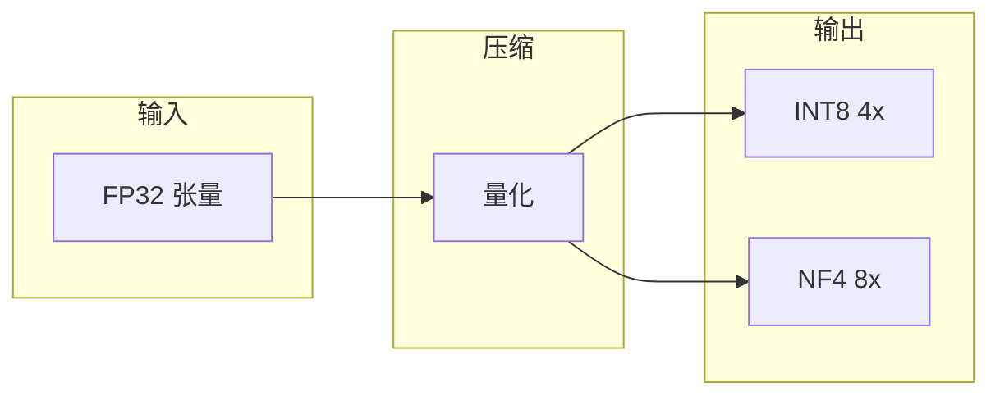
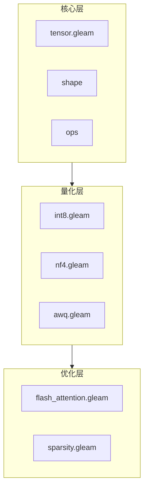

# viva_tensor

纯 Gleam 张量库，专注于内存压缩。

**[Português](../pt-br/README.md)** | **[English](../en/README.md)**

## 核心概念



**内存倍增：**

| 格式 | 压缩比 | 24GB VRAM |
|:-----|:------:|:----------|
| FP32 | 1x | 24 GB |
| INT8 | 4x | 96 GB |
| NF4 | 8x | 192 GB |

## 架构



## 文档

| 文档 | 描述 |
|:-----|:-----|
| [快速开始](getting-started.md) | 安装和入门 |
| [算法](algorithms.md) | INT8, NF4, AWQ, Flash Attention |
| [API](api.md) | 完整参考 |
| [为什么革命性](why-revolutionary.md) | 科学基准测试 |

## 构建

```bash
make build    # 编译
make test     # 测试
make bench    # 基准测试
```
