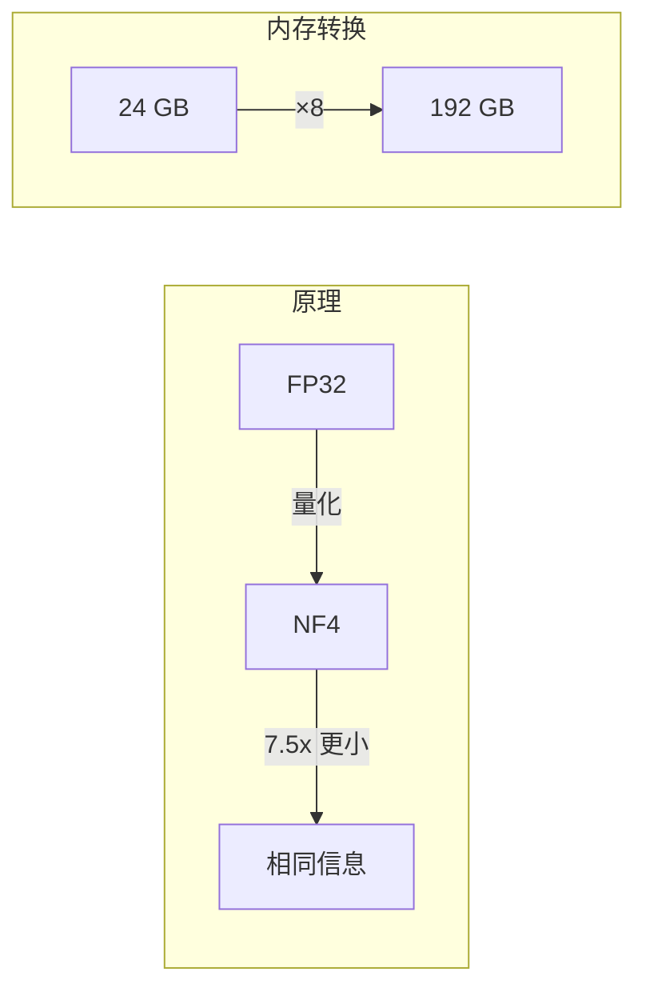
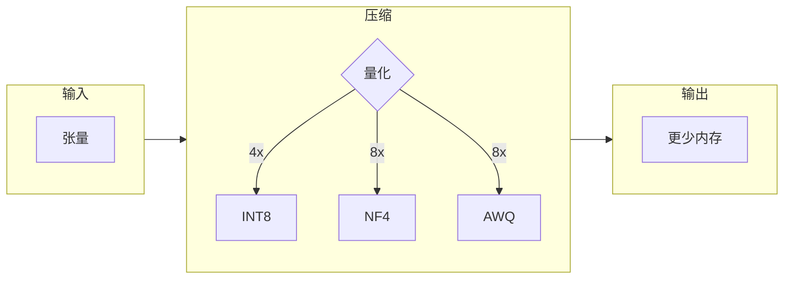
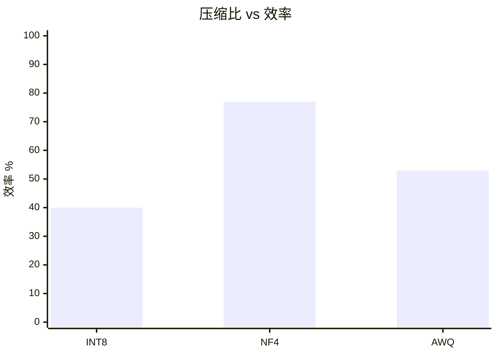

# viva_tensor



## 概念



## 快速开始

```gleam
import viva_tensor/nf4

let compressed = nf4.quantize(tensor, nf4.default_config())
// 8x 更少内存，相同信息
```

## 性能



| 方法 | 压缩比 | 效率 |
|:-----|:------:|:----:|
| INT8 | 4x | 40% |
| NF4 | 7.5x | 77% |
| AWQ | 7.7x | 53% |

**[API 参考 →](api.md)**
