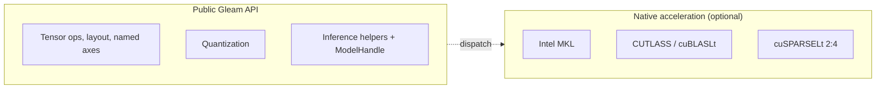

# viva_tensor

**[English](../en/README.md)** | **[Português](../pt-br/README.md)**

面向 Gleam/BEAM 的张量库，提供纯 Gleam 公共 API，并可选配
CUDA + CUTLASS NIF 以支持高吞吐推理。同一份 `import viva_tensor as t`
代码既可以在没有 CUDA 的笔记本上运行，也可以在带 FP8 Tensor Cores 的 RTX 4090 上运行。


```mermaid
flowchart LR
    subgraph PublicAPI["Public Gleam API"]
        T[Tensor ops, layout, named axes]
        Q[Quantization]
        I[Inference helpers + ModelHandle]
    end
    subgraph Native["Native acceleration (optional)"]
        MKL[Intel MKL]
        CUTLASS[CUTLASS / cuBLASLt]
        SPARSE[cuSPARSELt 2:4]
    end
    PublicAPI -.dispatch.-> Native
```

## 当前提供的能力

| 子系统                              | 状态        | 亮点                                                                                      |
| :--------------------------------- | :---------- | :---------------------------------------------------------------------------------------- |
| 纯 Gleam 张量 API                  | 稳定        | 形状、广播、基础自动微分、命名轴、回退执行。                                              |
| FP8 dense (CUTLASS + cuBLASLt)     | 生产可用    | RTX 4090 上约 ~588 TFLOPS。FP32 输出缓冲区（无 FP16 饱和）。                              |
| FP8 W8A16 + per-block-16 scales    | 生产可用    | 缩小相对 HF transformers 的数值差距；argmax token 与 fp32 参考一致。                      |
| Fused SwiGLU NIF                   | 生产可用    | 单个 kernel 执行 `silu(gate)·up`，并在 kernel 内进行 per-channel dequant。                 |
| INT8 2:4 sparse (cuSPARSELt)       | 生产可用    | ~1320 TOPS。通过 reorder_meta shim 获得字节精确 metadata。                                 |
| INT4 2:4 sparse (CUTLASS Sm80)     | 生产可用    | ~1854 TOPS。端到端字节精确（kernel + reorder + encoding 已自测）。                        |
| SafeTensors loader                 | 功能可用    | bf16 → fp32，通过 NIF 转置（完整 TinyLlama 从 3 分钟降至 25 秒）。                         |
| BPE tokenizer                      | 功能可用    | Encode/decode 与 HuggingFace transformers 位级一致。                                       |
| 公共 LLM `ModelHandle` API         | 生产可用    | 面向 TinyLlama-1.1B 和 Llama-3.2-1B-Instruct 的 `load_model` + `generate`。                |
| 高级采样 (temp/top-k/p)            | 功能可用    | 带可复现 seed 的 multinomial。                                                            |

## 快速开始

```bash
gleam add viva_tensor
```

```gleam
import viva_tensor as t

pub fn main() {
  let assert Ok(a) = t.matrix(2, 3, [1.0, 2.0, 3.0, 4.0, 5.0, 6.0])
  let assert Ok(b) = t.matrix(3, 2, [1.0, 0.0, 0.0, 1.0, 1.0, 0.0])
  let assert Ok(c) = t.matmul(a, b)
  c |> t.to_list
}
```

对于 Llama-family 文本生成（需要 CUDA）：

```gleam
let assert Ok(model) = t.load_model("tmp/tinyllama/model.safetensors")
let opts = t.default_generate_opts()
let assert Ok(result) = t.generate(model, "Hello", opts)
```

端到端 TinyLlama-1.1B 文本生成见 [`guides/inference.md`](guides/inference.md)。

## 文档地图

| 章节                                                                  | 内容                                                                                           |
| :-------------------------------------------------------------------- | :--------------------------------------------------------------------------------------------- |
| [`api/tensor.md`](api/tensor.md)                                      | 稳定公共表面：张量创建、数学运算、归约、布局、命名轴。                                         |
| [`api/inference.md`](api/inference.md)                                | FP8 prepack + linear、INT8/INT4 sparse、fused SwiGLU、packed weight handles。                   |
| [`api/llm.md`](api/llm.md)                                            | 公共 `ModelHandle` API：`load_model`、`generate`、选项、已测试模型。                           |
| [`guides/inference.md`](guides/inference.md)                          | 端到端 Llama-1.1B 推理：SafeTensors → prepack → forward → sample → decode。                    |
| [`guides/ffi-architecture.md`](guides/ffi-architecture.md)            | 面向维护者的 FFI 所有权契约（NIF / CUDA / Zig 边界）。                                         |
| [`reference/project-structure.md`](reference/project-structure.md)    | 包布局与模块边界。                                                                             |
| [`reference/stability.md`](reference/stability.md)                    | 稳定与实验边界、semver 预期。                                                                  |
| [`paper.md`](paper.md)                                                | 技术论文。                                                                                     |

## 性能快照

在 RTX 4090 (Ada SM89)、Driver 595.71.05、CUDA 12.9 上测得。形状和 dtype 的
完整方法与表格见 [`bench/results/matmul_showdown.md`](../../bench/results/matmul_showdown.md)。

| 路径                                  | 吞吐             |
| :------------------------------------ | :--------------- |
| FP8 dense (CUTLASS, K=4096)           | ~588 TFLOPS      |
| INT8 2:4 sparse (cuSPARSELt)          | ~1320 TOPS       |
| INT4 2:4 sparse (CUTLASS Sm89)        | ~1854 TOPS       |
| TinyLlama-1.1B best FP8 W8A16 decode  | 448 tok/s        |
| TinyLlama-1.1B via `ModelHandle`      | 2.31 ms/token    |
| Llama-3.2-1B-Instruct via `ModelHandle` | 2.47 ms/token  |

Llama tok/sec 数字受 NIF round-trip + BEAM marshaling 限制，而不是 GPU compute；
下一阶段吞吐目标是 fused single-block NIF。
