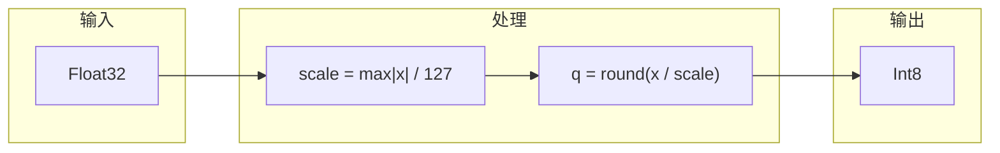
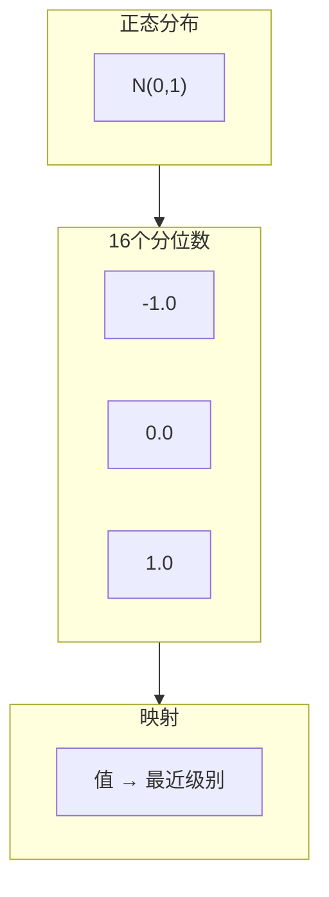
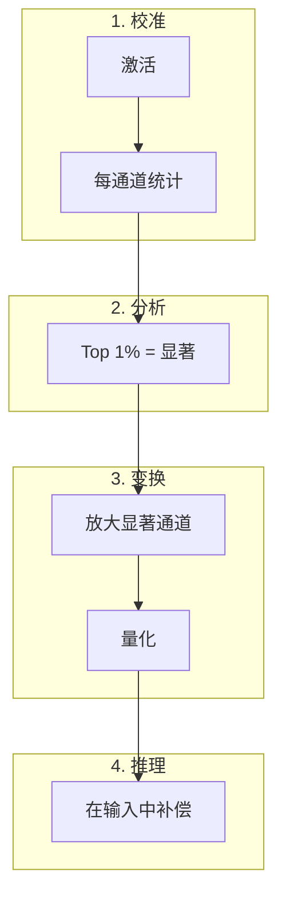
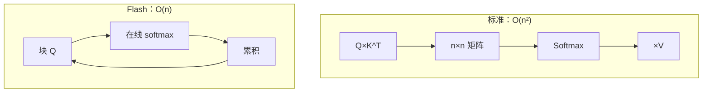
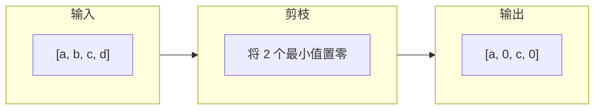

# 算法

## INT8 对称量化

使用线性缩放将 32 位减少到 8 位。



**公式：**

```
量化：  q = round(x / scale)
恢复：  x' = q × scale
```

| 属性 | 值 |
|:-----|:---|
| 压缩比 | 4x |
| 典型误差 | < 0.5% |
| 速度 | 非常快 |

---

## NF4 (NormalFloat4)

针对高斯分布优化的 4 位量化。



**为什么有效：**
- 神经网络权重遵循高斯分布
- 零附近有更多级别
- 对正态数据数学最优

---

## AWQ（激活感知权重量化）

MLSys 2024 最佳论文。使用激活来指导量化。



**关键洞察：**
- 约 1% 的权重是"显著的"
- 由激活幅度识别
- 量化前放大可保留信息

---

## Flash Attention

O(n) 内存注意力，而不是 O(n²)。



**技巧：在线 Softmax**

增量计算 max 和 sum，无需实现完整矩阵。

---

## 2:4 结构化稀疏

NVIDIA Tensor Cores 的稀疏模式。



**规则：** 每 4 个元素中，恰好 2 个为零。

| 属性 | 值 |
|:-----|:---|
| 压缩比 | 2x |
| 硬件开销 | 零 |
| 加速 | Tensor Cores 上 2x |
