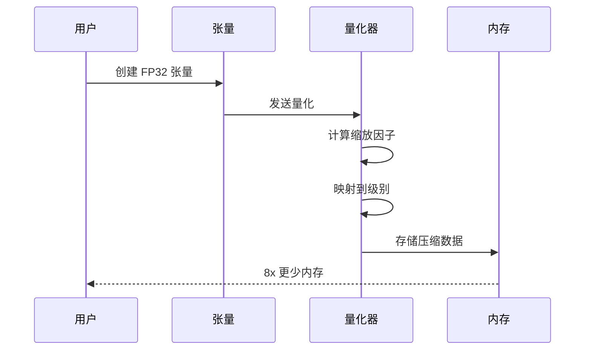
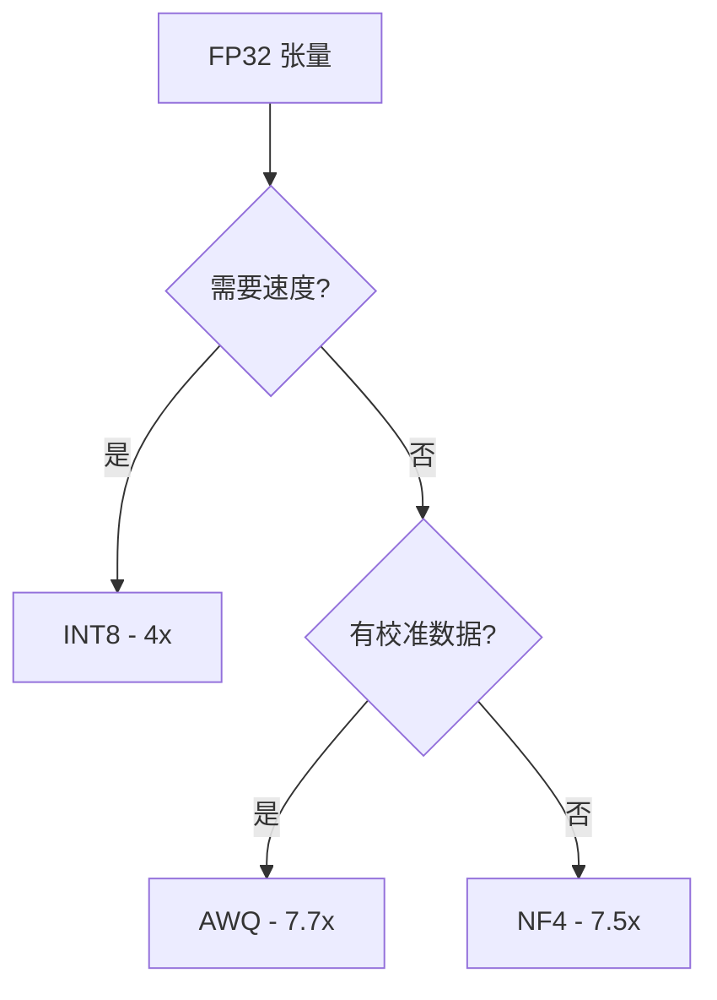

# 快速开始

## 安装

```bash
gleam add viva_tensor
```

## 要求

| 工具 | 版本 |
|:-----|:-----|
| Gleam | >= 1.6 |
| Erlang/OTP | >= 27 |

## 第一个示例

```gleam
import viva_tensor/tensor
import viva_tensor/nf4

pub fn main() {
  // 创建随机张量
  let t = tensor.random_uniform([1024, 512])

  // 量化为 NF4（8x 压缩）
  let config = nf4.default_config()
  let compressed = nf4.quantize(t, config)

  // 检查压缩比
  io.println("Ratio: " <> float.to_string(compressed.compression_ratio))

  // 恢复
  let restored = nf4.dequantize(compressed)
}
```

## 压缩流程



## 选择算法



| 算法 | 压缩比 | 使用场景 |
|:-----|:------:|:---------|
| INT8 | 4x | 速度优先，简单推理 |
| NF4 | 7.5x | 无校准数据，通用 |
| AWQ | 7.7x | 有校准数据，最高质量 |
