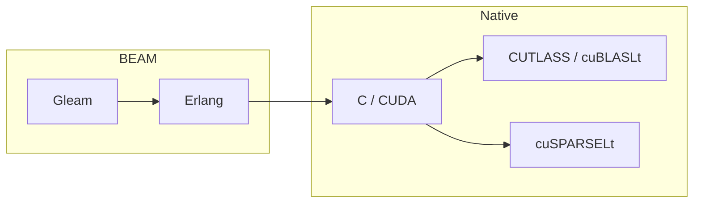
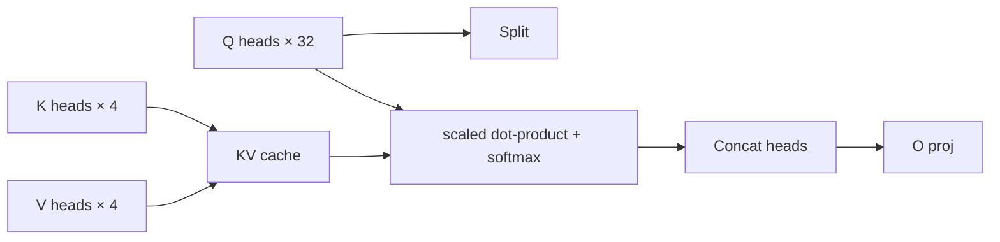

# viva_tensor：在 Ada Tensor Cores 上进行 FP8 推理的 Gleam/BEAM 张量库

**Gabriel Maia** · VIVA Research · 2026

---

## 摘要

`viva_tensor` 是一个运行在 BEAM runtime 上、面向 Gleam 的张量库，并配套一个可选的
CUDA + CUTLASS NIF，用于缩小 BEAM 应用与现代 GPU 推理栈之间的吞吐差距。该库结合了：

1. 一个纯 Gleam 张量 API，可在任何 BEAM 可运行的环境中运行（不需要 CUDA），并提供
   shape 语义、broadcasting、named axes 以及一个小型 autograd 表面。
2. 面向 RTX 4090 级别（Ada SM89）硬件的生产级 FP8 dense matmul（~588 TFLOPS）、
   INT8 2:4 sparse（~1320 TOPS）和 INT4 2:4 sparse（~1854 TOPS）kernel，并通过
   CUTLASS reference uncompress / reorder 做字节精确验证。
3. 一个足以端到端运行 TinyLlama-1.1B 的完整推理引擎：SafeTensors loader、BPE tokenizer、
   RoPE、带 KV cache 的 GQA、fused SwiGLU、RMSNorm、LM head、multinomial sampling。
   BOS 后的 argmax token 与 HuggingFace `transformers` fp32 参考一致。

目标并不是击败成熟的 C++ 推理引擎。`viva_tensor` 不提供自定义 scheduler、
paged attention 或 continuous batching。它的贡献在于证明：**只要谨慎设计 NIF 边界，
BEAM 应用也可以以完整吞吐调用现代 Tensor Core kernels**；同时，将低比特推理引入
BEAM 并不需要牺牲数值正确性。



---

## 数值历程：缩小与 HuggingFace transformers 的差距

一个核心方法选择，是将每条 dtype 路径都对照 HuggingFace `transformers` fp32 作为黄金参考进行验证。
TinyLlama-1.1B 在仅 BOS 的 forward 后，argmax token 是 token id `529`。每次迭代如下：

| 迭代                                       | argmax token | 说明                                                        |
| :----------------------------------------- | :----------- | :---------------------------------------------------------- |
| FP8×FP8 with `FP8_E4M3_MAX = 128`          | 908          | 该 token 在 HF logits 中排名 30200/32000。存在幅值偏置。    |
| `FP8_E4M3_MAX = 448` (IEEE-correct)        | 18182        | Q/K/V proj 从 0.47× 移动到 0.68× HF 幅值。                  |
| FP16 subnormal IEEE-754 fix                | 2136         | 单个阶段更接近；主要差距仍然存在。                         |
| **W8A16** (FP16 input × FP8 weight)        | 6763         | 输出通道中 50% 零消失；这是结构性修复。                    |
| **W8A16 + per-block-16 K-axis scales**     | **529** ✅   | 与 HF 参考完全一致。                                       |

W8A16 路径跳过输入量化：输入保持 FP16，FP8 weight 通过 kernel 即时 dequant 到 FP16，
然后 cuBLAS FP16×FP16 GEMM 使用 FP32 accumulation 执行。使用 per-block scales
（沿 K 轴 `block_size=16`）后，per-output-channel 结构在 GEMM 中得以保留，
argmax 收敛到 HF 参考。

这与 TensorRT-LLM 和 vLLM 在 FP8 weight 量化上的结论一致：对于带有混合符号条目的真实
LLM weights，per-tensor scales 不够。

---

## 架构

### Public Gleam API

公共表面是根 `viva_tensor` 模块加三个 companion modules（`layout`、`axis`、`named`）。
所有其他模块均为内部模块。

```gleam
import viva_tensor as t

let assert Ok(a) = t.matrix(2, 3, [1.0, 2.0, 3.0, 4.0, 5.0, 6.0])
let assert Ok(b) = t.matrix(3, 2, [1.0, 0.0, 0.0, 1.0, 1.0, 0.0])
let assert Ok(c) = t.matmul(a, b)
```

该库遵循 **graceful-degradation** 原则：每个公共函数都有纯 Gleam fallback。
如果共享对象存在，NIF 会动态加载；否则相同调用点仍可继续工作，只是更慢。

### 原生加速层

```
┌──────────────────────────────────────────────────────────────┐
│ Gleam public API (viva_tensor)                               │
└──────────────────────────────────────────────────────────────┘
                  ↓
┌──────────────────────────────────────────────────────────────┐
│ Internal dispatch (core/ffi.gleam, native/*.gleam)           │
└──────────────────────────────────────────────────────────────┘
                  ↓
┌─────────────┬─────────────┬──────────────┬─────────────────┐
│ MKL / Zig   │ CUDA + CUTLASS │ cuBLASLt   │ cuSPARSELt 2:4  │
│ SIMD (CPU)  │ FP8/FP16 GEMM  │ INT8 IMMA  │ INT8/FP8/FP16   │
└─────────────┴─────────────┴──────────────┴─────────────────┘
```

NIF 边界位于 `zig_src/`。按 dtype 划分的 prepack 和 linear NIF 会暴露不透明的
`PackedWeight*` handles，用于持有驻留设备端的量化 weight，以及 per-channel
（或 per-block）scale buffers。

### 量化格式

| 格式             | 稀疏性          | 存储 / element | Tensor Core            | 路径                                  |
| :--------------- | :-------------- | :------------- | :--------------------- | :------------------------------------ |
| FP8 E4M3 dense   | —               | 1 byte         | Ada FP8 TC             | CUTLASS f32acc_out_f32                |
| FP8 E4M3 + W8A16 | —               | 1 byte (weight)| Ada FP16 TC            | Dequant kernel + cuBLAS FP16 GEMM     |
| INT8 2:4 sparse  | 50% structured  | 1 byte         | Ada IMMA TC            | cuSPARSELt MatmulSearch               |
| INT4 2:4 sparse  | 50% structured  | 4 bits         | Ampere/Ada Sparse TC   | CUTLASS m16n8k128 GemmSparseUniversal |
| NF4 (NormalFloat 4)| —             | 4 bits         | — (CPU)                | Pure-Gleam reference                  |

### KV cache 与 attention

参考 Llama driver（`dev/llama_forward.erl`）实现完整 GQA pipeline：

- **RoPE**：按 head 对 Q 和 K 应用 rotary positional embedding。
- **GQA**：32 个 query heads 分组到 4 个 KV heads（8:1）。
- **KV cache**：每层 list-of-binaries，每次追加一个 token。迁移到 persistent device resource 正在跟踪中。
- **Single-token softmax**：在完整 KV cache 上做完整 softmax，无近似。



---

## 性能

### 仅 kernel 吞吐（RTX 4090, K=4096, M=N=4096）

| 路径                            | 吞吐              |
| :------------------------------ | :---------------- |
| FP8 dense (CUTLASS, FP32 out)   | ~588 TFLOPS       |
| FP16 dense (cuBLASLt)           | ~165 TFLOPS       |
| INT8 2:4 sparse (cuSPARSELt)    | ~1320 TOPS        |
| INT4 2:4 sparse (CUTLASS)       | ~1854 TOPS        |

### 端到端推理

在 RTX 4090 上运行 TinyLlama-1.1B（22 layers, hidden=2048, ffn=5632, vocab=32000）：

| 阶段                                | 时间             |
| :---------------------------------- | :--------------- |
| Load + prepack (22 layers + LM head) | ~28 s          |
| Public-handle decode                | 2.31 ms/token   |
| Best FP8 W8A16 decode run           | 448 tok/sec     |
| Ollama local baseline               | 352 tok/sec     |

Llama-3.2-1B-Instruct 通过相同的 `ModelHandle` API 验证，速度为 `2.47 ms/token`。

端到端吞吐当前受每个 linear 的 BEAM ↔ NIF marshaling 成本限制，而不是 GPU compute。
每层 7 个 linears 平均每次调用约 ~660 µs；相同形状的原始 cuBLAS 为 50–120 µs。
计划中的下一次吞吐跃迁是 fused single-block NIF，它会让 hidden state 在整个 block 中保持
device-resident（目标约 ~11 tok/sec）。

---

## 正确性验证

- **CUTLASS INT4 sparse self-test**：`cutlass_int4_sparse_self_test()` 在
  (256, 256, 256) 上相对 reference `uncompress()` + host GEMM 产生
  `diffs=0, max_abs_diff=0`。
- **FP8 path bisect**：layer-0 forward 每个阶段的 `mean_abs` 都与 HF transformers fp32
  参考匹配，Q proj 在 1.08× 内、K proj 为 1.00×（block_size=16，见
  [`guides/inference.md`](guides/inference.md)）。
- **Tokenizer**：encode/decode 在 4 个跨语言样本（PT、EN、emoji、newlines）上与
  HuggingFace `transformers` 位级一致。
- 截至本文撰写时，**792 / 792** unit + behavior tests 通过。

---

## 限制与未来工作

1. **NIF call boundary**。每个 linear 需要支付约 ~500 µs 的 marshaling + NIF call overhead，
   在典型 Llama shapes 中超过实际 GEMM 成本。fused single-block NIF 将恢复其中大部分吞吐。
   跟踪于 [`bench/plans/INFERENCE_API_PLAN.md`](../../bench/plans/INFERENCE_API_PLAN.md)。

2. **Persistent KV cache**。当前每层 cache 是 host 上的 list-of-binaries。
   对长上下文（> 2k tokens），它应迁移到 device-resident resource ref。

3. **True FP8xFP8 decode 被推迟。** `zig_src/cuda_fp8_cutlass.cu` 已包含可工作的
   CUTLASS FP8xFP8 GEMM entrypoints，但生产 LLM 路径使用 per-K-block weight scales
   （`block_size=16`）以及面向 `batch=1` decode 的 W8A16 custom GEMV。量化 single-token input
   在 hidden size 2048 时每 token 只能节省约 4 KB，而 FP8 weights 主导内存流量。这可能只在真实的
   batched prefill path（`batch >= 8`）中重要；该路径尚未发布。

4. **Multi-GPU / continuous batching**。超出范围。`viva_tensor` 被设计为构建块，而不是 serving system。
   如果需要这些功能，请配合外部 schedulers（vLLM、llama.cpp）。

5. **Calibration**。SmoothQuant prototype 位于 `dev/llama_calibration.erl`，但默认未接线。
   AWQ / GPTQ 集成可以缩小 block_size=128 上剩余的幅值差距（目前使用 block=16，
   在该模型规模下无需 calibration）。

6. **硬件覆盖**。Ada SM89 是主要目标。Hopper SM90 + Blackwell-class FP4 / NVFP4 跟踪于
   [`bench/plans/NVFP4_EVT_PLAN.md`](../../bench/plans/NVFP4_EVT_PLAN.md)，
   但尚未实现（手头没有硬件）。

---

## 相关工作

- **TensorRT-LLM** 和 **vLLM** 发布 per-block FP8 quantization，原因与 `viva_tensor`
  相同：per-channel scales 在真实 LLM weights 上会损失过多精度。
- **llama.cpp** 对 INT8 weights 使用 block_q8_0（block=32）；同样的模式启发了这里的
  per-block FP8 路径。
- **CUTLASS** 提供底层 Sm80/Sm89 Tensor Op templates；`viva_tensor` 添加了 host-side prepack，
  使其匹配 INT4 sparse 的 CUTLASS `ColumnMajorInterleaved<2>` metadata layout 以及 FP8 dense 的
  block-K scale layout。

---

## 复现

```bash
# Build
make cutlass-libs   # CUTLASS + cuSPARSELt static archives
make zig            # the NIF .so

# End-to-end TinyLlama
erlc -o /tmp dev/llama_forward.erl
erl -pa /tmp -pa build/dev/erlang/viva_tensor/ebin -noshell \
    -eval 'llama_forward:run_generate_w8a16(22, <<"Hello">>, 20, #{}, 16), halt(0).'

# Bisect against HF reference
tmp/hf_ref/bin/python dev/hf_bisect.py
erl -pa /tmp -pa build/dev/erlang/viva_tensor/ebin -noshell \
    -s llama_forward bisect_w8a16_blocked 16 -s init stop
```

完整设置见 [`guides/inference.md`](guides/inference.md)。

---

## 许可证

BSD-3-Clause（与 CUTLASS upstream parts 匹配）。
