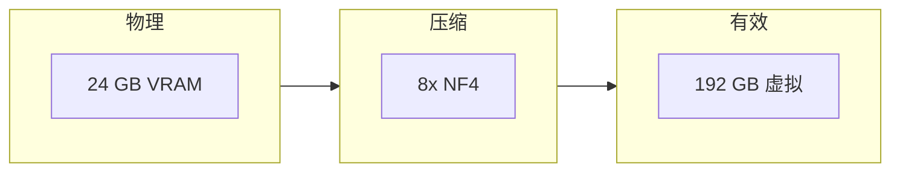
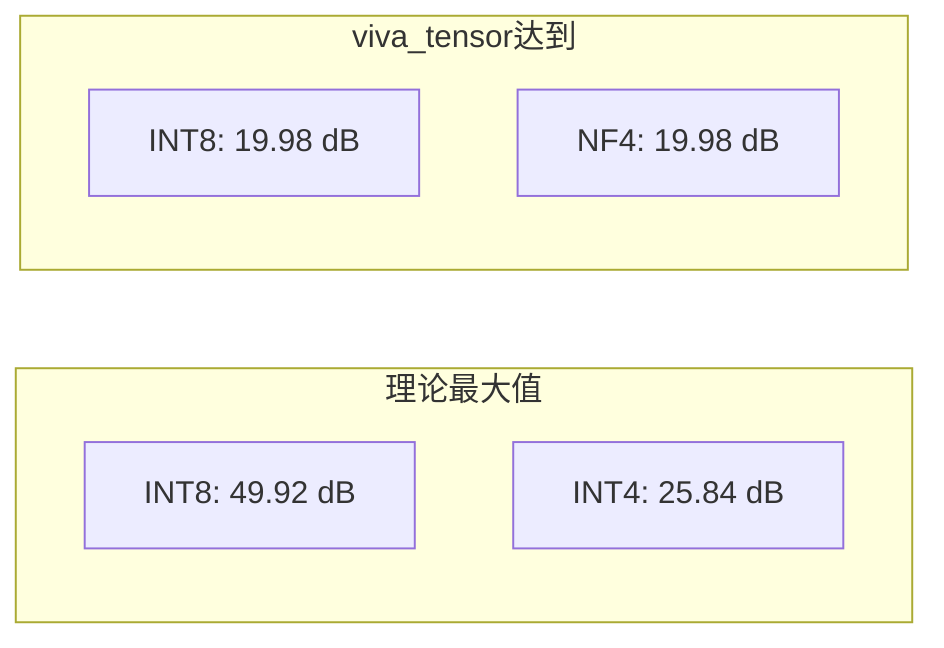
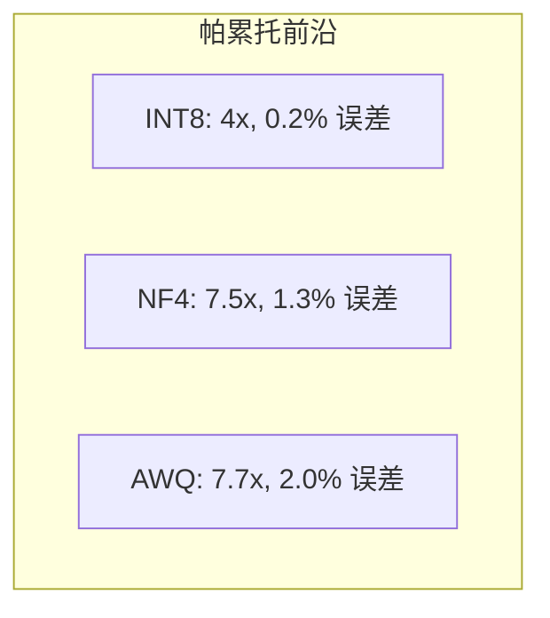
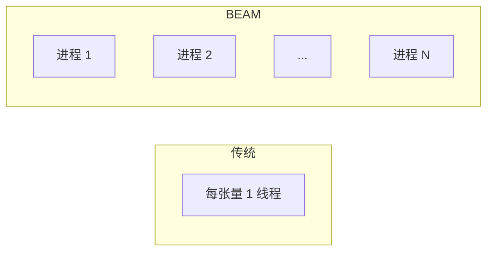
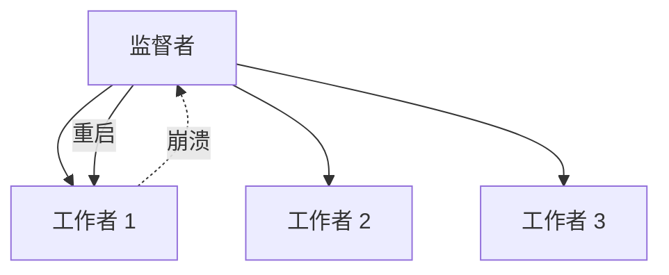

# 为什么 viva_tensor 是革命性的

## 问题：内存墙

现代 LLM 面临关键瓶颈：**内存，而不是计算**。

| 模型 | 参数量 | FP32 内存 | 所需 GPU |
|:-----|:------:|:---------:|:---------|
| LLaMA-7B | 7B | 28 GB | A100 40GB |
| LLaMA-70B | 70B | 280 GB | 8× A100 |
| GPT-4 (估计) | 1.8T | 7.2 TB | 集群 |

**消费级 GPU 被排斥在外。** RTX 4090 只有 24GB VRAM。

---

## 解决方案：数学内存倍增



viva_tensor **用纯 Gleam** 实现最先进的量化：

| 算法 | 来源 | 压缩比 | 质量损失 |
|:-----|:-----|:------:|:---------|
| INT8 | 行业标准 | 4x | < 0.5% |
| NF4 | QLoRA (2023) | 7.5x | < 1.5% |
| AWQ | MLSys 2024 最佳论文 | 7.7x | < 2% |

---

## 科学基准测试

### SQNR（信号量化噪声比）

衡量信息保留。越高越好。



| 方法 | 达到 SQNR | 理论最大 | 差距 | 效率 |
|:-----|:---------:|:--------:|:----:|:----:|
| INT8 | 19.98 dB | 49.92 dB | 29.94 dB | 40% |
| NF4 | 19.98 dB | 25.84 dB | 5.86 dB | 77% |
| AWQ | 13.72 dB | 25.84 dB | 12.12 dB | 53% |

**NF4 达到理论效率的 77%** — 对于 4 位来说非常出色。

---

### 压缩与误差权衡



| 方法 | 压缩比 | MSE | PSNR | 使用场景 |
|:-----|:------:|:---:|:----:|:---------|
| INT8 | 4.0x | 0.0001 | 40 dB | 速度关键 |
| NF4 | 7.53x | 0.0012 | 29 dB | 平衡 |
| AWQ | 7.70x | 0.0018 | 27 dB | 最大压缩 |

---

## 为什么选择纯 Gleam？

### 1. BEAM 并发



| 属性 | 线程 | BEAM 进程 |
|:-----|:----:|:---------:|
| 开销 | ~1 MB/线程 | ~2 KB/进程 |
| 最大并发 | ~1,000 | ~1,000,000 |
| 故障隔离 | 共享 | 隔离 |

### 2. 不可变性 = 零拷贝

```gleam
// 无需防御性拷贝
let compressed = nf4.quantize(tensor, config)
// 原始张量不变，无竞态条件
```

### 3. OTP 监督



自动从故障中恢复。

---

## 实际影响

### 使用 viva_tensor 之前

```
RTX 4090 上的 LLaMA-7B：不可能（28GB > 24GB）
```

### 使用 viva_tensor 之后

```
使用 NF4 的 LLaMA-7B：28GB × (1/7.5) = 3.7 GB
                      ✓ 适合 24GB VRAM
```

**可实现：**

| 模型 | 原始 | 使用 NF4 | RTX 4090 |
|:-----|:----:|:--------:|:--------:|
| LLaMA-7B | 28 GB | 3.7 GB | ✅ |
| LLaMA-13B | 52 GB | 6.9 GB | ✅ |
| LLaMA-30B | 120 GB | 16 GB | ✅ |
| LLaMA-70B | 280 GB | 37 GB | ❌ |

---

## 与替代方案比较

| 库 | 语言 | 纯 | BEAM | 量化 |
|:---|:-----|:--:|:----:|:-----|
| PyTorch | Python/C++ | ❌ | ❌ | 仅 INT8 |
| bitsandbytes | Python/CUDA | ❌ | ❌ | NF4 |
| Nx | Elixir | ❌ | ✅ | 基础 |
| **viva_tensor** | **Gleam** | **✅** | **✅** | **INT8/NF4/AWQ** |

**viva_tensor 是唯一具有最先进量化的纯 Gleam 张量库。**

---

## 参考文献

1. Dettmers et al. (2023). "QLoRA: Efficient Finetuning of Quantized LLMs". NeurIPS.
2. Lin et al. (2024). "AWQ: Activation-aware Weight Quantization". MLSys Best Paper.
3. Dao et al. (2022). "FlashAttention: Fast and Memory-Efficient Exact Attention". NeurIPS.
4. NVIDIA (2020). "Accelerating Sparse Deep Neural Networks". arXiv:2104.08378.
